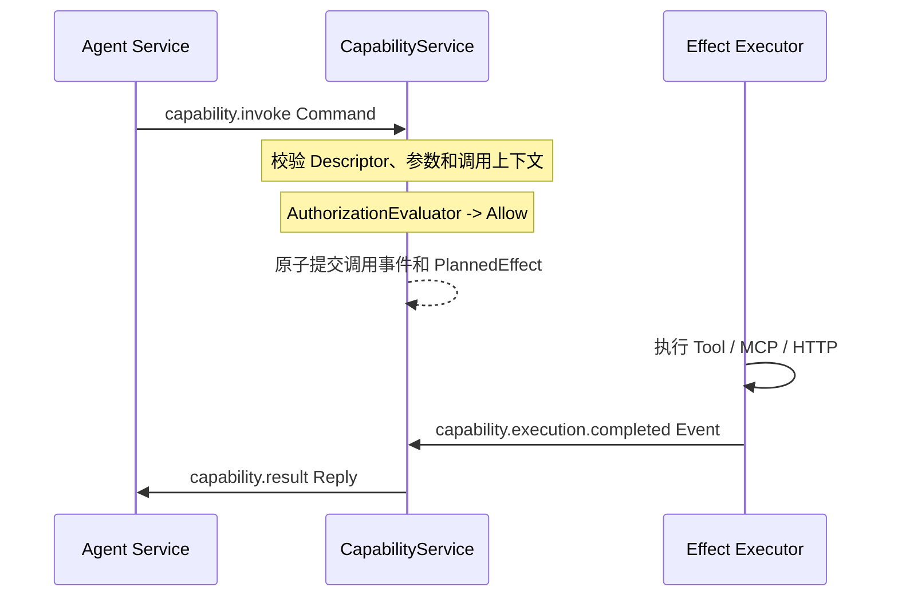
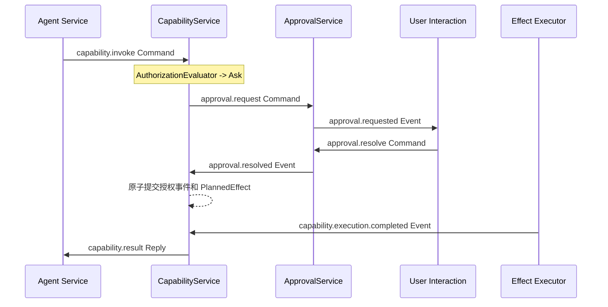

# CapabilityService 与 ApprovalService 开发边界

> 状态：开发指导基线
> 日期：2026-07-21
> 适用范围：挂载到 `serviceruntime` 的能力调用与人工审批模块
> 通用约束：同时遵守 [Service 开发规范](service-development-guide.md)

## 1. 设计结论

第一阶段在能力调用与人工审批域只引入两个业务 ServiceDefinition：

```text
Agent Service
  -> CapabilityService
       -> 内置 AuthorizationEvaluator
       -> ApprovalService（仅在需要人工确认时）
       -> PlannedEffect -> Tool / MCP / HTTP Executor
       -> Outgoing Command -> 已经具有独立状态所有权的业务 Service
```

- `CapabilityService` 是 Agent 使用能力的唯一入口，也是 `CapabilityCallState` 的唯一写入者。
- `ApprovalService` 是人工审批请求的唯一入口，也是 `ApprovalState` 的唯一写入者。
- Capability 权限规则由 `CapabilityService` 内部的确定性 `AuthorizationEvaluator` 执行，不再设置独立 `PolicyService`。
- Tool、MCP、HTTP 和本地执行适配器不是 Service；它们作为 Capability Provider、Effect Executor、Reconciler 或进程资源注册。
- 不为每个 Tool、MCP Server 或 Executor 创建 Mailbox、Journal、Snapshot 和 ServiceInstance。
- 已经因独立业务状态、Saga 或恢复要求而存在的服务仍保持独立，例如 Knowledge Gateway。CapabilityService 可以向它发送消息，但不把它重新包装成“Tool 级业务 Service”。

这里的 Service 是 Runtime 内的逻辑服务，不等同于独立进程或微服务。第一阶段两个 Service 都可以运行在同一个 Go 进程中。

## 2. 为什么是两个 Service

`CapabilityService` 和 `ApprovalService` 都满足成为 Service 的条件，但 Provider 和 Executor 通常不满足。

| 对象 | 是否为 Service | 原因 |
| --- | --- | --- |
| `CapabilityService` | 是 | 拥有调用 Saga、Pending Call、结果关联和恢复状态 |
| `ApprovalService` | 是 | 审批可能长时间等待，需要独立 Mailbox、审计、并发决议和崩溃恢复 |
| `AuthorizationEvaluator` | 否 | 输入确定时输出确定，无独立持久化状态 |
| `CapabilityProvider` | 否 | 负责描述能力并形成执行计划，不拥有独立业务状态 |
| Tool / MCP / HTTP Executor | 否 | 只执行已经持久化的 Effect |
| Reconciler | 否 | 只处理外部结果未知的 Effect 恢复 |
| Knowledge Gateway 等业务服务 | 是 | 自己拥有独立状态、协议或 Saga，并非因为它“提供能力”才成为 Service |

拆分依据是状态所有权和恢复边界，不是 Tool 数量或代码复用需求。

## 3. 总体调用流程

### 3.1 不需要人工审批



### 3.2 需要人工审批



整个流程都通过 Durable Message、Journal、Outbox 和 Effect 推进。任何 Service 都不能同步等待另一个 Service，也不能直接调用另一个 Service 的 Go 对象。

## 4. CapabilityService 边界

### 4.1 唯一拥有的状态

`CapabilityService` 是 `CapabilityCallState` 的唯一写入者，至少记录：

```go
type CapabilityCallState struct {
    CallID              string
    InvocationMessageID string
    Caller              ServiceAddress
    ReplyTo             ServiceAddress
    CapabilityRef       string
    CapabilityVersion   string
    DescriptorRevision  string
    Phase               CapabilityCallPhase

    ArgumentsRef *ArtifactRef
    Arguments    json.RawMessage

    AuthorizationDecision string
    AuthorizationRule     string
    ApprovalID            string

    ExecutionKind string
    ExecutionKey  string
    ExecutorRef   string

    ResultRef *ArtifactRef
    Result    json.RawMessage
    ErrorCode string
    Deadline  *time.Time
}
```

实际 State 可以按 `CallID` 保存多个 Pending Call。第一阶段建议挂载一个 `ScopeRuntimeSingleton` 实例；CLI 场景的并发量较小，这比为每次调用创建 Virtual Service 更容易维护。

终态记录不能无约束增长。实现时必须定义完成记录保留期、业务幂等窗口和终态 tombstone 策略；在该策略确定前，不得直接删除仍用于拒绝重复 `CallID` 的记录。

CapabilityService 可以保存已经确认的审批结果事实，但不复制完整 ApprovalState、审批交互历史或审批队列。

### 4.2 负责的事情

CapabilityService 负责：

1. 接收和校验 `capability.invoke`。
2. 校验 `CallID`、CapabilityRef、版本、参数 Schema、Deadline 和调用来源。
3. 从不可变 Capability Catalog 中解析 Descriptor 和 Provider。
4. 调用内部 `AuthorizationEvaluator` 得到 `Allow`、`Ask` 或 `Deny`。
5. 持久化权限判断使用的规则版本、原因码和必要审计摘要。
6. `Ask` 时创建稳定 `ApprovalID`，向 ApprovalService 发送 `approval.request`。
7. 接收并校验 `approval.resolved`，恢复等待中的调用。
8. 根据 Provider 形成 `PlannedEffect`，或者向已经独立存在的业务 Service 发送 Command。
9. 维护调用阶段、重试关联、取消意图、Deadline 和最终结果。
10. 接收执行结果的 Durable Message，完成调用并向原始 `ReplyTo` 发送统一结果。
11. 对重复 CallID、重复审批结果、重复 Effect 回调和乱序消息保持幂等。

### 4.3 不负责的事情

CapabilityService 不负责：

- 在 `Handle` 中直接执行 Shell、MCP、HTTP、文件写入或其他外部操作。
- 保存 Token、Secret、SDK Client、MCP Session、Socket 或进程句柄。
- 实现 CLI、TUI、Web UI 等审批展示和用户输入。
- 写入 ApprovalState，或者替 ApprovalService 决定某个用户是否有权响应审批。
- 修改 AgentState、TaskState、GoalState 或其他服务的状态。
- 承担所有业务工作流；只有 Capability 调用自身的 Saga 属于它。
- 把 Runtime Store、EventBus、Host 或其他 Service 对象注入业务实现。
- 因为某个 Tool 可复用，就为它动态创建 ServiceInstance。

### 4.4 AuthorizationEvaluator

权限规则是 CapabilityService 内部的确定性组件，不是 Service：

```go
type AuthorizationEvaluator interface {
    Evaluate(input AuthorizationInput) (AuthorizationDecision, error)
}
```

输入应由可信配置、Capability Descriptor、当前持久化调用事实和经过验证的消息上下文组成。输出至少包含：

```text
Decision = allow | ask | deny
RuleRef
ReasonCode
RiskSummary（Ask 时）
ApprovalScope（第一阶段只支持 call）
```

约束：

- 相同规则版本和相同输入必须产生相同结果。
- 不读取网络、当前进程的可变全局状态或其他 Service 状态。
- 不信任调用者在 Metadata 中自报的 Grant、Owner、Depth 或权限。
- 规则必须由 PlanRevision 或显式配置版本固定；恢复旧 PlanRevision 时仍能加载对应规则。
- 第一阶段审批只授权一个 `CallID`，不要提前引入跨调用永久 Grant。
- 如果未来需要组织级动态授权、跨调用 Grant、预算中心或独立规则生命周期，再评估拆出 PolicyService；当前方案不预留同步对象调用捷径。

### 4.5 Capability Catalog 与 Provider

Capability Catalog 是模块在 Build 前注册的不可变目录，至少包含：

```go
type CapabilityDescriptor struct {
    Ref             string
    Version         string
    InputSchema     SchemaRef
    OutputSchema    SchemaRef
    RiskTags        []string
    ProviderRef     string
    ExecutionKind   string
    ExecutorRef     string
    DescriptorRevision string
}
```

Provider 负责把已验证调用转换成声明式执行计划：

```go
type CapabilityProvider interface {
    Describe() []CapabilityDescriptor
    Plan(input CapabilityInvocation) (CapabilityExecutionPlan, error)
}
```

Provider 必须是确定性的，不执行外部操作。执行计划只能是以下两类之一：

- `EffectPlan`：生成 `PlannedEffect`，用于 Tool、MCP、HTTP 或本地操作。
- `ServiceCommandPlan`：生成 Outgoing Command，发给本来就拥有独立业务状态的服务。

Catalog、Provider 和 Executor 都由 Capability 模块显式注册。Runtime 核心不得导入 Capability 包，也不得按 CapabilityRef 写特殊分支。

### 4.6 Effect 与执行结果反馈

外部能力必须通过 `PlannedEffect` 执行：

```text
EffectType       稳定、带 capability 命名空间
ExecutorRef      显式版本，例如 mcp.call@v1
IdempotencyKey   从 CallID + ExecutionKey 派生
Payload          只包含执行所需数据或 ArtifactRef
Deadline         不晚于 CapabilityCall Deadline
```

Executor 不是 Service。它可以持有 MCP Client、HTTP Client、Tool 实现和其他进程资源，但不能修改 CapabilityService 的内存 State。

Effect 结果要推进 CapabilityCallState 时，必须通过 Durable Message 返回 CapabilityService。建议使用从 `EffectID` 派生的稳定 MessageID：

```text
capability.execution.completed
capability.execution.failed
```

当前 Runtime 的 Effect Store 结果不能由业务 Service 直接读取，因此 Capability 模块必须提供明确的结果反馈路径。可以由模块的 RuntimeBinder/Driver 将 Executor 回调转换为 Durable Message；如果以后 Runtime 提供通用 Effect completion routing，再迁移到通用机制。

Executor 和 Reconciler 必须使用相同结果 MessageID。若进程在外部操作成功后、结果消息确认前崩溃，Reconciler 先确认外部事实，再发送同一个结果消息。Inbox 去重保证重复回调不会重复完成调用。

### 4.7 建议消息契约

CapabilityService 最小消息面：

| 类型 | Kind | 来源 | 用途 |
| --- | --- | --- | --- |
| `capability.invoke` | Command | Agent/业务服务 | 创建或幂等取得一次调用 |
| `capability.cancel` | Command | 原调用者/Orchestrator | 记录取消意图 |
| `capability.get` | Query | 授权调用者 | 查询调用状态 |
| `capability.list` | Query | Agent/Model 适配层 | 读取可见 Descriptor；不得修改状态 |
| `approval.resolved` | Event | ApprovalService | 继续或拒绝等待中的调用 |
| `approval.cancelled` | Event | ApprovalService | 终止等待中的调用 |
| `approval.expired` | Event | ApprovalService | 使等待调用进入终态 |
| `capability.execution.completed` | Event | Capability 模块 Ingress | 记录外部成功结果 |
| `capability.execution.failed` | Event | Capability 模块 Ingress | 记录外部终态失败 |
| 下游业务 Reply | Reply | 独立业务 Service | 完成 ServiceCommandPlan |

CapabilityService 最小输出：

- `approval.request` Command。
- `approval.cancel` Command。
- Provider 形成的 `PlannedEffect` 或业务 Command。
- `capability.result` Reply，定向发送到原调用的 `ReplyTo`。
- 必要的公开集成事件，例如 `capability.call.waiting_approval`、`capability.call.completed`。

延迟完成时不能使用当前审批消息的直接 Reply 冒充对原始 Agent 调用的响应。CapabilityService 应保存原始 `ReplyTo`，完成 Saga 时生成定向 Outgoing Reply，并继承原始 CorrelationID。

### 4.8 建议状态机

```text
Received
  -> Denied
  -> Cancelled
  -> WaitingApproval
       -> Denied
       -> Expired
       -> Cancelled
       -> Authorized
  -> Authorized
       -> Cancelled
       -> WaitingExecution
            -> Succeeded
            -> Failed
            -> Cancelled
```

约束：

- `Succeeded`、`Failed`、`Denied`、`Expired`、`Cancelled` 是终态，重复输入只能返回相同语义结果。
- Cancel 是取消意图，不等同于外部副作用已经回滚。已开始执行的写操作必须按 Executor/Reconciler 的事实处理。
- 过期调用不得再创建新 Effect。
- 审批结果必须同时匹配 ApprovalID、CallID、请求 CapabilityRef 和预期 ApprovalService 地址。
- 执行结果必须匹配 CallID、ExecutionKey、ExecutorRef 和当前执行代次。

## 5. ApprovalService 边界

### 5.1 唯一拥有的状态

`ApprovalService` 是 `ApprovalState` 的唯一写入者：

```go
type ApprovalState struct {
    ApprovalID      string
    RequestMessageID string
    Requester       ServiceAddress
    NotifyTo        ServiceAddress
    CallID          string
    UserID          string
    CapabilityRef   string
    CapabilityVersion string
    Status          ApprovalStatus
    RiskSummary     string
    ArgumentsDigest string
    ArgumentsRef    *ArtifactRef
    RequestedAt     time.Time
    ExpiresAt       *time.Time
    DecidedAt       *time.Time
    DecidedBy       string
    Decision        string
    ReasonCode      string
}
```

第一阶段建议使用一个 `ScopeRuntimeSingleton` 实例，State 保存 Pending Approval 和必要的终态审计索引。完整参数、Secret 和大文本不能进入审批 Snapshot；审批展示需要的内容使用脱敏摘要或 ArtifactRef。

### 5.2 负责的事情

ApprovalService 负责：

1. 接收 `approval.request` 并校验请求来源、ApprovalID、CallID、用户、摘要和过期时间。
2. 幂等创建 ApprovalState。
3. 发布可由 CLI/TUI/UI 展示的 `approval.requested` 事件。
4. 接收用户的 approve、deny、cancel 操作。
5. 验证响应者是否有权处理该审批，以及审批是否仍处于 Pending。
6. 处理重复响应、并发响应、过期和取消，保证终态不可逆。
7. 将 `approval.resolved`、`approval.cancelled` 或 `approval.expired` 定向发送给原 Requester。
8. 保存必要审计事实，包括请求人、决策人、时间、原因码和参数摘要。
9. 在重启后恢复所有 Pending Approval，并继续等待用户输入。

### 5.3 不负责的事情

ApprovalService 不负责：

- 判断一次 CapabilityCall 是否需要审批；这是 CapabilityService 的 AuthorizationEvaluator 职责。
- 校验 Capability 参数 Schema 或选择 Executor。
- 执行 Tool、MCP、HTTP、Shell 或文件操作。
- 修改 CapabilityCallState、AgentState 或 TaskState。
- 持有 Capability Provider、Tool Registry 或 Runtime Store。
- 同步阻塞 `Handle` 等待用户输入。
- 将“用户点击批准”解释为外部命令已经执行成功。
- 默认发放跨调用、永久或可转授的 Grant；第一阶段审批仅绑定一个 CallID。

ApprovalService 可以校验“谁有权响应审批”，但不能重新计算“为什么该调用需要审批”。前者保护 ApprovalState，后者属于 Capability 授权规则。

### 5.4 建议消息契约

ApprovalService 最小消息面：

| 类型 | Kind | 来源 | 用途 |
| --- | --- | --- | --- |
| `approval.request` | Command | CapabilityService | 创建审批请求 |
| `approval.resolve` | Command | 可信用户交互入口 | approve 或 deny |
| `approval.cancel` | Command | CapabilityService/原请求方 | 取消尚未决议的审批 |
| `approval.expire` | Command | 受信任调度入口 | 将到期 Pending 请求转为 Expired |
| `approval.get` | Query | 授权调用者 | 查询单个审批状态 |
| `approval.list_pending` | Query | 用户交互入口 | 查询当前用户可处理的审批 |

输出至少包括：

- `approval.requested` Event，供用户交互层展示。
- `approval.resolved` Event，携带 approve/deny、ApprovalID、CallID 和审计摘要。
- `approval.cancelled` Event。
- `approval.expired` Event。

所有结果事件默认显式设置 `To = Requester`，不要广播包含敏感摘要的审批事件。

### 5.5 建议状态机

```text
Pending
  -> Approved
  -> Denied
  -> Cancelled
  -> Expired
```

规则：

- 只有 `Pending` 可以进入终态。
- 第一个合法终态决议胜出；后续相同决议幂等返回，冲突决议返回稳定错误。
- `ApprovalID` 必须由 CallID 和规则/请求版本稳定派生，重复 Outbox 投递不能创建第二个审批。
- 到期时间必须作为持久化事实进入事件，Replay 不读取当前时间重新判断历史事件。
- 自动过期由定时 Durable Command 或恢复扫描触发，不能依赖只存在于内存的 Timer。
- 审批结果只表示用户决定，不表示 Capability 已执行。

## 6. 两个 Service 的状态所有权

| 业务事实 | 唯一写入者 | 另一个 Service 可以保存什么 |
| --- | --- | --- |
| Capability 调用阶段和最终结果 | CapabilityService | ApprovalService 只保存 CallID 引用 |
| 是否按规则 Allow/Ask/Deny | CapabilityService | ApprovalService 不复制规则计算过程 |
| Approval 请求生命周期 | ApprovalService | CapabilityService 只保存 ApprovalID 和已确认结果 |
| 谁响应了审批 | ApprovalService | CapabilityService 只保存结果中的必要审计摘要 |
| Effect 执行事实 | Effect Store/Worker | CapabilityService 保存收到的业务结果事实 |
| Agent 等待哪次调用 | Agent Service | CapabilityService 只保存 Caller/ReplyTo |

任何一方都不能直接读取或写入另一方的 Snapshot、Journal 或内存 State。

## 7. Scope、地址和依赖

第一阶段建议：

```text
CapabilityService
  Scope: ScopeRuntimeSingleton
  Address: capability.main
  Dependency: approval -> approval.main

ApprovalService
  Scope: ScopeRuntimeSingleton
  Address: approval.main
  Dependency: 可选的用户交互/通知地址
```

`ServiceDefinition.Dependencies` 只声明地址和可接受 ServiceType，不注入目标对象。若当前创建协议还不能把解析后的依赖地址交给 Service，应先补齐通用可序列化依赖绑定，不能读取全局 Plan 绕过边界。

未来吞吐增加时，可以将同一个 `CapabilityService` ServiceDefinition 按稳定键做 Mounted Shard；这增加实例数量，不增加 Service 类型数量。没有测量到 Mailbox 瓶颈前，不提前分片。

## 8. 安全与数据边界

- Secret、Token、MCP 凭据和连接句柄只存在于 Executor 的安全配置或进程资源中。
- Message、Event、Snapshot 和日志不保存明文 Secret。
- 参数可能敏感时保存 `ArtifactRef`、checksum 和脱敏摘要。
- CapabilityService 必须验证消息来源，不能只根据 CapabilityRef 决定权限。
- ApprovalService 必须验证用户交互入口和决策人身份，不能信任任意 Service 构造的 `DecidedBy`。
- 对外错误使用稳定错误码，不回显完整命令、环境变量、Token 或敏感参数。
- Descriptor 中的风险标签只是权限输入，不能代替 AuthorizationEvaluator。
- Approval 的展示内容必须足够让用户理解风险，但不得泄露无关 Secret。

## 9. 错误、重试与恢复语义

### 9.1 领域拒绝

以下情况通常是不可重试的业务结果：

- Capability 不存在或版本不兼容。
- 参数 Schema 不合法。
- AuthorizationEvaluator 返回 Deny。
- 用户拒绝审批。
- 审批过期。

它们应形成稳定领域事件和 `capability.result` 错误，不依赖 Runtime 重试修复。

### 9.2 基础设施与外部失败

- Inbox Lease、Sequence Conflict 和暂时性提交错误交给 Runtime 重试。
- Executor 的暂时性网络错误按 Effect RetryPolicy 重试。
- 外部操作结果未知时必须进入 Reconciliation，不能盲目重做。
- 外部系统明确返回业务失败时，通过稳定结果消息完成 CapabilityCall，避免无意义重试。
- Effect 达到最终失败但没有业务结果反馈时，CapabilityCall 会永久等待。实现前必须提供终态失败通知或恢复扫描机制，不能依赖人工读取 Effect Store 后直接改 State。

### 9.3 关键崩溃点

必须验证：

1. `capability.invoke` 提交前崩溃：消息重试，不产生重复 Call。
2. Approval Outbox 提交后、投递前崩溃：恢复后继续投递同一个 ApprovalID。
3. 等待用户时崩溃：ApprovalService 和 CapabilityService 分别从各自 Journal 恢复 Pending 状态。
4. 用户已批准、CapabilityService 尚未处理时崩溃：审批结果继续可靠投递。
5. Effect 已计划、尚未执行时崩溃：Pending Effect 恢复执行。
6. 外部操作完成、Effect 未落库时崩溃：Reconciler 先确认外部事实。
7. 结果回调重复或乱序：稳定 MessageID 和状态前置条件阻止重复完成。
8. Capability 已取消后收到迟到成功结果：记录外部事实，但不能把已终止调用静默改回成功；是否补偿由明确策略决定。

## 10. 建议包结构

两个业务 Service 分包，但由一个上层模块组合注册：

```text
capability/
  contract.go
  types.go
  state.go
  service.go
  factory.go
  authorization.go
  catalog.go
  provider.go
  effects.go
  module.go
  *_test.go

approval/
  contract.go
  types.go
  state.go
  service.go
  factory.go
  module.go
  *_test.go
```

目录可以按项目后续模块布局调整，但不要放进 Runtime 核心包，也不要依赖已归档的 `internal/`。

Capability 模块的 `Register` 至少完成：

1. 注册 CapabilityService Definition。
2. 注册 ApprovalService Definition，或者要求调用方显式安装 Approval 模块。
3. 注册 Catalog、Provider、Executor 和 Reconciler。
4. 注册必要的 PlanValidator，检查 Descriptor 重名、未知 ExecutorRef、版本和依赖地址。
5. 只有在执行结果需要外部 callback 回到 Durable Inbox 时注册 RuntimeBinder。

## 11. 测试要求

### 11.1 CapabilityService 单元测试

- Descriptor 不存在、版本不兼容和参数 Schema 错误。
- Allow、Ask、Deny 三条授权路径。
- 相同 MessageID 和相同 CallID 的幂等行为。
- 相同 CallID 但参数、调用者或 CapabilityRef 冲突时拒绝。
- Ask 只产生一个稳定 ApprovalID。
- 审批批准、拒绝、过期、取消、重复和乱序结果。
- Effect Key、IdempotencyKey 和结果 MessageID 稳定。
- 执行成功、业务失败、暂时失败和未知结果。
- Query 不产生 Event 或 Effect。
- 终态不可逆，迟到消息不能重新打开调用。
- Apply 只根据 StoredEvent 更新 State，Replay 不调用 Provider、Evaluator 或 Executor。

### 11.2 ApprovalService 单元测试

- 重复 request 幂等，相同 ApprovalID 内容冲突时拒绝。
- 只有授权入口和授权用户可以 resolve。
- approve、deny、cancel、expire 的合法迁移。
- 并发冲突决议只有第一个生效。
- 相同终态决议重复提交返回相同语义结果。
- 过期时间来自持久化事件，Replay 不读取当前时间。
- 结果事件显式定向到原 Requester。
- Pending Approval 重启后仍可处理。

### 11.3 集成与恢复测试

- `Agent -> Capability -> Effect -> Capability -> Agent` 完整 Allow 流程。
- `Agent -> Capability -> Approval -> User -> Capability -> Effect` 完整 Ask 流程。
- Deny 流程不创建 Approval 和 Effect。
- 用户拒绝流程不创建 Effect。
- 重复 Outbox、重复结果回调和重启恢复不重复外部操作。
- 外部操作成功但结果未知时 Reconciler 不盲目重做。
- Pending Approval、Pending Effect 和 Pending Reply 在重启后继续推进。
- 旧 PlanRevision 可以解析旧 Descriptor、规则版本和 ExecutorRef。
- Capability/Approval Message、Event、Reply 和 Effect 均满足 inline Payload 限制。

测试使用 fake AuthorizationEvaluator、fake Provider、fake Executor、fake Reconciler、fake Clock 和内存 Store，不调用真实 Shell、MCP、网络或用户界面。

## 12. 第一阶段实现顺序

1. 固定两个 Service 的 ComponentRef、Scope、地址和消息版本。
2. 定义 CapabilityCallState、ApprovalState、阶段和领域错误码。
3. 定义 Capability Catalog、Descriptor、Provider 和 AuthorizationEvaluator 接口。
4. 先实现 ApprovalService 状态机及幂等/恢复测试。
5. 实现 CapabilityService 的校验与 Allow/Ask/Deny 决策。
6. 打通 Ask 的双 Service 消息闭环。
7. 接入一个 fake Executor，验证 Effect 结果回到 Durable Inbox。
8. 接入第一个本地 Tool Executor，再接入 MCP Provider/Executor。
9. 增加 Reconciler、终态失败通知和崩溃点测试。
10. 最后增加 Catalog 查询、终态保留策略和可观测 Projection。

## 13. 开发前检查表

- [ ] 当前新增对象真的拥有独立状态吗？若没有，不创建 Service。
- [ ] CapabilityCallState 只有 CapabilityService 写入。
- [ ] ApprovalState 只有 ApprovalService 写入。
- [ ] 权限判断是 CapabilityService 内部的确定性组件。
- [ ] ApprovalService 只管理人工决议，不重新实现 Capability 权限规则。
- [ ] Tool、MCP 和 HTTP 通过 Provider/Effect Executor 注册，不创建 Tool 级业务 Service。
- [ ] Handle 没有直接执行外部操作或同步等待审批。
- [ ] Effect 结果有 Durable Message 回到 CapabilityService。
- [ ] 外部写操作有稳定 IdempotencyKey 和 Reconciler。
- [ ] ApprovalID、CallID、ExecutionKey 和结果 MessageID 稳定。
- [ ] 大参数和结果使用 ArtifactRef，持久化内容不包含 Secret。
- [ ] 两个 Service 都能从 InitialState + Journal 完整恢复。
- [ ] 重复、乱序、过期、取消和崩溃路径都有测试。

