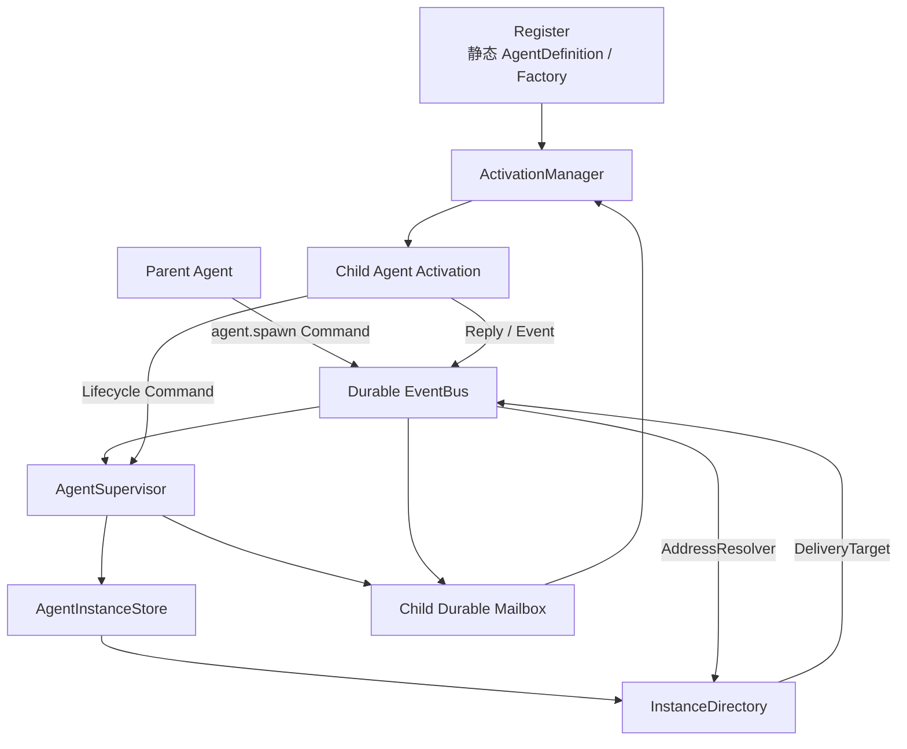
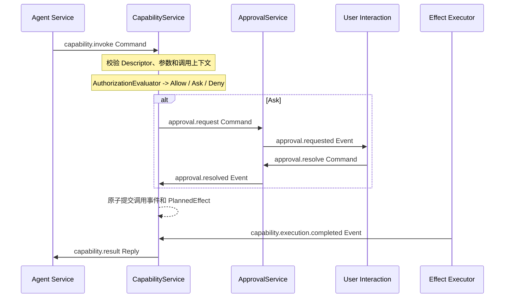
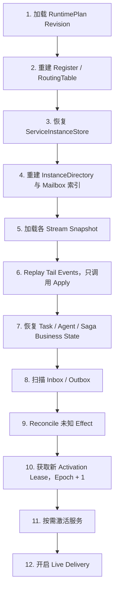
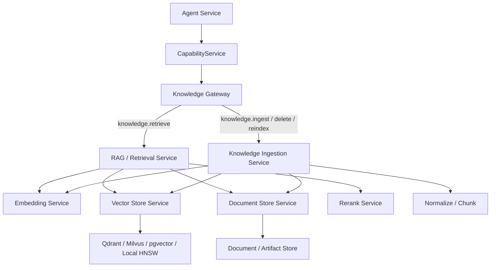
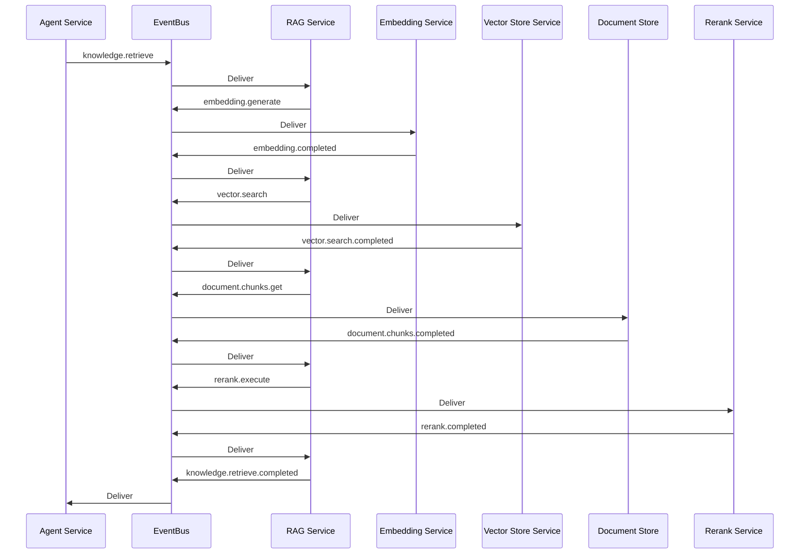

# 事件溯源服务 Runtime 架构

> 状态：目标架构草案  
> 更新时间：2026-07-21
> 对应图：`project-architecture.drawio` 第三页 `Event-Sourced Service Runtime`

## 1. 架构定位

新的 Runtime 不再被设计成一个内部直接持有 Agent、Tool、Policy 和 Orchestrator 实例的大对象，而是一个进程内的事件溯源服务运行平台。

在这个模型里：

- Agent、CapabilityService、ApprovalService、Orchestrator、Memory 和 Model 等按各自状态所有权挂载；Tool、MCP 和 HTTP Executor 不是业务 Service。
- 服务拥有自己的状态，不直接读写其他服务的状态。
- 服务之间不持有彼此的实际对象，只通过可序列化消息通信。
- EventBus 是可靠的虚拟网络，负责持久化、路由、投递、确认和重试。
- Register 是构建期控制平面，负责注册服务定义并编译路由。
- RuntimeBuilder 根据配置生成不可变 RuntimePlan，再由 ServiceHost 创建服务实例。
- Journal 是服务恢复的事实来源，Snapshot 用于减少事件重放成本。
- Orchestrator 是业务协调者；EventBus 不理解业务完成、重试策略和响应聚合。

该架构首先以单 Go 进程实现，但消息、服务地址和配置都必须可序列化。未来如果某个业务 Service 或 Capability Executor 需要迁移到独立进程，可以增加远程 Transport 或远程执行 Worker，而不改变上层协议。

## 2. 角色映射

| 组件 | 架构角色 | 主要职责 |
| --- | --- | --- |
| `RuntimeBuilder` | 部署控制器 | 读取配置、装载模块、调用 Register、生成 RuntimePlan |
| `Register` | 服务注册中心和路由编译器 | 注册 ServiceDefinition，校验引用，编译 RoutingTable |
| `RuntimePlan` | 不可变部署计划 | 固定服务版本、挂载地址、配置、路由和恢复策略 |
| `ServiceHost` | 服务宿主 | 创建服务实例、管理生命周期、提供 Mailbox 和运行上下文 |
| `EventBus` | 可靠消息网络 | 持久化、单播、发布订阅、ACK、Retry、Dead Letter |
| `Inbox` | 服务收件箱 | Claim、去重、顺序控制、处理确认 |
| `Outbox` | 服务发件箱 | 在状态提交后可靠发送 Command、Reply、Event 和 Effect |
| `Journal` | 状态事实来源 | 保存服务产生的领域事件，支持 Replay 和审计 |
| `Snapshot Store` | 恢复加速器 | 保存某个 Sequence 对应的服务状态快照 |
| `Orchestrator Service` | Saga / Workflow Coordinator | 目标拆解、任务协调、响应聚合、失败补偿 |
| `Agent Service` | 单任务推理服务 | 使用静态 AgentSpec 和动态 Invocation 推进模型回合 |
| `AgentSupervisor` | Agent 监督服务 | 统一创建 Root/Child Agent，检查 ForkPolicy，管理取消和终止 |
| `AgentInstanceStore` | 动态实例事实存储 | 保存 AgentInstanceRecord、父子关系、地址和生命周期 |
| `InstanceDirectory` | 动态地址目录 | 将 Agent ServiceAddress 解析为 Durable Mailbox 投递目标 |
| `ActivationManager` | 虚拟 Agent 激活器 | 根据 DefinitionRef、Snapshot 和 Mailbox 按需创建或释放内存 Agent |
| `CapabilityService` | Capability 调用服务 | 统一入口、调用 Saga、内置权限判断、Provider 路由和结果关联 |
| `ApprovalService` | 人工审批服务 | 审批请求、用户决议、过期、取消和审计 |
| Capability Provider / Effect Executor | 非 Service 模块组件 | 描述能力、形成执行计划并执行 Tool、MCP、HTTP 或本地副作用 |
| `Model Service` | 模型能力服务 | Provider 适配、模型请求和响应归一化 |
| `Memory Service` | 长期记忆服务 | 用户档案、习惯、偏好、事件记忆的提取和维护 |
| `Knowledge Gateway` | 知识能力入口 | 对 Agent 暴露统一的 Retrieve、Ingest、Delete 和 Reindex 能力 |
| `RAG / Retrieval Service` | 知识读取编排器 | Query Embedding、Vector Search、Chunk Load、Rerank 和引用组装 |
| `Knowledge Ingestion Service` | 知识写入 Saga | 规范化、切片、Embedding、Vector Upsert、验证、更新和删除 |
| `Embedding Service` | 向量生成服务 | Provider 适配、批量 Embedding、缓存、限流和模型版本管理 |
| `Vector Store Service` | 向量数据库服务 | Search、Upsert、Delete、Get 和外部向量库适配 |
| `Document Store Service` | 文档事实存储 | 保存原文、Chunk、Revision、Metadata、ACL 和 Citation 信息 |
| `Rerank Service` | 检索重排服务 | 对向量召回结果进行语义重排，可选挂载 |

## 3. RuntimeBuilding：定义、配置和实例分离

### 3.1 ServiceDefinition

ServiceDefinition 描述一种可部署的服务类型。它属于启动期静态信息，不包含当前用户、会话或 Run 状态。

```go
type ServiceDefinition struct {
    Type         ServiceType
    Version      string
    Factory      ServiceFactory
    Consumes     []MessageType
    Produces     []MessageType
    Dependencies []ServiceDependency
    StateSchema  SchemaRef
    ConfigSchema SchemaRef
    Scope        ServiceScope
}
```

同一个定义可以创建多个服务实例，例如：

```text
agent.personal
agent.research

memory.personal
memory.team

knowledge.workspace.personal
knowledge.workspace.team
```

### 3.2 RuntimeManifest

RuntimeManifest 描述本次 Runtime 需要部署哪些服务，以及消息如何路由。配置只引用 ServiceDefinition，不保存 Go 对象。

```yaml
runtime:
  id: personal-assistant
  revision: v1

services:
  - address: orchestrator.main
    component: orchestrator.goal@v1

  - address: agent.personal
    component: agent.static@v1
    config:
      agent_ref: personal-assistant

  - address: approval.main
    component: approval.service@v1

  - address: capability.main
    component: capability.service@v1
    config:
      catalog_revision: builtin-v1
      authorization_rules_revision: default-v1

  - address: model.default
    component: model.provider@v1

  - address: memory.personal
    component: memory.personal@v1

  - address: knowledge.gateway
    component: knowledge.gateway@v1

  - address: knowledge.retrieval
    component: rag.retrieval@v1

  - address: knowledge.ingestion
    component: knowledge.ingestion@v1

  - address: embedding.default
    component: embedding.provider@v1

  - address: vector.default
    component: vector.qdrant@v1

  - address: document.default
    component: document.store@v1

  - address: rerank.default
    component: rerank.provider@v1

routes:
  commands:
    goal.submit: orchestrator.main
    agent.execute: agent.personal
    approval.request: approval.main
    approval.resolve: approval.main
    capability.invoke: capability.main
    model.complete: model.default
    knowledge.retrieve: knowledge.gateway
    knowledge.ingest: knowledge.gateway
    knowledge.delete: knowledge.gateway
    knowledge.reindex: knowledge.gateway
    embedding.generate: embedding.default
    vector.search: vector.default
    vector.upsert: vector.default
    vector.delete: vector.default
    document.get: document.default
    document.upsert: document.default
    rerank.execute: rerank.default

  events:
    run.completed:
      - orchestrator.main
      - memory.personal
```

### 3.3 Register

Register 在 RuntimeBuilding 阶段可变，负责接收模块注册并编译配置。

```go
type Register struct {
    definitions map[ServiceType]ServiceDefinition
    routes      []RouteDefinition
}

func (r *Register) RegisterService(def ServiceDefinition) error
func (r *Register) RegisterRoute(route RouteDefinition) error
func (r *Register) Compile(manifest RuntimeManifest) (*RuntimePlan, error)
```

Compile 至少需要检查：

- 服务地址是否重复。
- ServiceDefinition 和版本是否存在。
- 配置是否符合 ConfigSchema。
- Command 和 Query 是否只有一个目标服务。
- Event 订阅者是否存在。
- 服务依赖是否完整，是否存在依赖环。
- Agent 引用的 Model、Skill、MemoryPolicy 是否存在。
- Capability Selector 是否能解析到实际 CapabilityDefinition。
- 每种外部 Effect 是否存在 Executor 或目标服务。

Compile 成功后生成不可变 RuntimePlan。Runtime 运行期间不能修改该 Plan；配置变化必须创建新的 Plan Revision。每个 Run 都要记录自己使用的 Plan Revision，保证重启恢复时仍使用原有服务和路由版本。

## 4. 消息模型

EventBus 可以统一传输 Message Envelope，但消息语义必须区分为四类。

| Kind | 含义 | 路由方式 | 是否允许改变目标服务状态 |
| --- | --- | --- | --- |
| Command | 请求某个服务执行动作 | 单播 | 是 |
| Query | 请求读取信息 | 单播 | 否 |
| Event | 某件事情已经发生 | 发布订阅 | 由订阅者自行决定如何响应 |
| Reply | 对 Command 或 Query 的响应 | 按 ReplyTo 定向返回 | 由接收者决定 |

建议的统一消息结构：

```go
type Message struct {
    ID            string
    Kind          MessageKind
    Type          MessageType
    Version       int

    From          ServiceAddress
    To            ServiceAddress
    ReplyTo       ServiceAddress

    RuntimeID     string
    PlanRevision  string
    UserID        string
    GoalID        string
    RunID         string

    CorrelationID string
    CausationID   string

    StreamID      string
    Sequence      uint64

    Deadline      *time.Time
    Attempt       int

    Payload       json.RawMessage
    Metadata      map[string]string
}
```

关键字段约定：

- `ID`：全局稳定消息 ID，用于 Inbox 去重。
- `From`、`To`、`ReplyTo`：服务级寻址，不使用 Go 对象引用。
- `CorrelationID`：关联一次完整调用或工作流。
- `CausationID`：记录当前消息由哪个消息产生。
- `StreamID`：定义需要严格顺序处理的消息分区，通常是 RunID、GoalID 或 CapabilityCallID。
- `Sequence`：同一 Stream 内的单调序号。
- `PlanRevision`：保证路由和服务版本可恢复。
- `Payload`：只放可序列化数据；大对象放入 Artifact Store，并在消息中保存引用。

## 5. 服务处理协议

服务分为 Live Handle 和 Replay Apply 两条路径。

```go
type Service interface {
    Descriptor() ServiceDescriptor

    Handle(
        ctx context.Context,
        state ServiceState,
        message Message,
    ) (Decision, error)

    Apply(
        state ServiceState,
        event Event,
    ) (ServiceState, error)
}

type Decision struct {
    Events   []NewEvent
    Outgoing []OutgoingMessage
    Effects  []Effect
    Reply    *Reply
}
```

### 5.1 Live 模式

正常处理时执行：

```text
Inbox Message
  → Service.Handle
  → Domain Events + Outgoing Messages + Effects
  → 原子保存 Inbox ACK + Journal + Snapshot + Outbox
  → Outbox Dispatcher 将消息交给 EventBus
```

服务不能在 `Handle` 内直接调用 EventBus.Publish，因为这样无法保证“状态已经保存”和“消息已经发送”的一致性。服务应该返回 Outgoing，由 ServiceHost 在同一事务中写入 Outbox。

### 5.2 Replay 模式

恢复时只执行：

```text
Snapshot State
  + Journal Events after Snapshot.Sequence
  → Service.Apply
  → Current ServiceState
```

`Apply` 必须是确定性的纯状态转换，禁止：

- 调用 LLM。
- 调用 Capability 或 MCP。
- 发送消息。
- 请求用户输入。
- 访问网络。
- 使用当前时间决定状态。
- 生成随机 ID。

时间、ID 和外部结果必须已经存在于历史 Event 中。

## 6. EventBus 边界

EventBus 负责：

- 根据 `To` 将 Command、Query、Reply 单播到目标服务。
- 根据 RoutingTable 将 Event 发布给零到多个订阅者。
- 在目标 Inbox 中持久化投递。
- Claim、Lease、ACK、Retry 和 Dead Letter。
- 使用 MessageID 去重。
- 按 StreamID 和 Sequence 维持必要顺序。
- 在 Runtime 切换到 Live 模式前暂停新消息投递。

EventBus 不负责：

- 判断 Goal 或 Run 是否完成。
- 等待并聚合多个服务响应。
- 决定 Capability 失败后的替代策略。
- 选择 Agent。
- 判断是否需要用户确认。
- 决定业务补偿流程。

如果一个请求需要多个服务响应，由 Orchestrator 或专门的 Aggregator Service 保存聚合状态：

```go
type RequestGroup struct {
    CorrelationID   string
    ExpectedReplies []ServiceAddress
    ReceivedReplies map[ServiceAddress]Reply
    Strategy        ReplyStrategy
}
```

EventBus 是网络，不是大脑。

## 7. Agent Service

Agent 被设计成静态定义：

```go
type AgentSpec struct {
    Ref                 string
    Version             string
    ModelRef            string
    PromptRef           string
    SkillRefs           []string
    CapabilitySelectors []CapabilitySelector
    MemoryPolicyRef     string
    LoopStrategyRef     string
}
```

动态信息通过 `AgentInvocation` 传入：

```go
type AgentInvocation struct {
    RunID        string
    UserID       string
    Input        string
    Messages     []Message
    Memories     []Memory
    Capabilities []CapabilityDescriptor
    Metadata     map[string]string
}
```

Agent Service 不持有 Capability 实例，只看到 CapabilityDescriptor。模型只能创建声明式 CapabilityCall：

```go
type CapabilityCall struct {
    CallID         string
    RunID          string
    CapabilityRef  string
    Arguments      json.RawMessage
    IdempotencyKey string
}
```

可用 Capability 列表由 Runtime 在 Run 创建时解析：

```text
Runtime 已部署 Capability
∩ AgentSpec Capability Selector
∩ Skill 所需 Capability
∩ 本次 Invocation Grant
∩ 用户 Policy
= Resolved Capability View
```

解析结果及版本必须写入 RunSnapshot，避免 RuntimePlan 升级后旧 Run 获得不同能力。

### 7.1 静态 Agent 定义与动态 Agent 实例

`AgentSpec` 和 Agent ServiceDefinition 是启动期静态定义，描述系统知道如何运行哪一种 Agent。主 Agent、子 Agent 和多级子 Agent 则是运行过程中产生的动态逻辑实例。

两者必须分开：

```text
Register
  保存 Agent ServiceDefinition、AgentSpec 和 Factory
  Build 后冻结

AgentInstanceStore / InstanceDirectory
  保存运行期出现的 Root Agent、Child Agent 和 Grandchild Agent
  可以动态增加、Passivate、恢复和 Tombstone
```

所有 Agent，包括主 Agent，都走同一套实例生命周期。主 Agent 只是 `ParentID` 为空、`Depth` 为零的根实例，不需要在 Runtime 中编写特殊创建分支。

```text
Root Agent
  InstanceID = agent-root-001
  ParentID   = ""
  RootID     = agent-root-001
  Depth      = 0

Child Agent
  InstanceID = agent-child-001
  ParentID   = agent-root-001
  RootID     = agent-root-001
  Depth      = 1

Grandchild Agent
  InstanceID = agent-child-002
  ParentID   = agent-child-001
  RootID     = agent-root-001
  Depth      = 2
```

实例通过 `ParentID` 和 `RootID` 形成监督树，但不是在某个 Record 对象内部嵌套 Agent 对象。

### 7.2 动态 Agent 的运行时组件

动态 Agent 使用虚拟 Actor 模型。Runtime 需要增加四个明确分工的组件：

| 组件 | 职责 |
| --- | --- |
| `AgentSupervisor` | 创建、取消、终止 Agent，检查深度、并发、预算和父子关系 |
| `AgentInstanceStore` | 持久化 AgentInstanceRecord 和生命周期状态 |
| `InstanceDirectory` | 按 ServiceAddress 查询逻辑实例及其 Mailbox 投递目标 |
| `ActivationManager` | 使用静态 Factory 按需创建和释放临时内存 Agent 对象 |



`AgentInstanceRecord` 只是持久化数据，不创建 Agent、不发送消息，也不执行查询：

```go
type AgentInstanceRecord struct {
    InstanceID    string
    Address       ServiceAddress
    DefinitionRef string
    AgentSpecRef  string
    PlanRevision  string

    ParentID      string
    RootID        string
    Depth         int

    GoalID        string
    RunID         string
    MailboxID     string
    ReplyTo       ServiceAddress

    Status        AgentInstanceStatus
    CreatedAt     time.Time
    UpdatedAt     time.Time
    CompletedAt   *time.Time
}
```

禁止把行为重新塞回 Record：

```go
// 不允许采用这类设计：
record.CreateAgent()
record.FindChild()
record.SendMessage()
```

Agent 的完整逻辑实例由四部分组成：

```text
AgentInstanceRecord
  身份、父子关系、版本、地址和生命周期

AgentState / Snapshot
  消息、计划、Pending Calls、等待状态和执行结果

Durable Mailbox
  尚未处理的 Command、Reply 和 Event

Agent Activation
  处理消息时临时存在的 Go 内存对象
```

### 7.3 AgentSupervisor 与 Spawn 协议

父 Agent 不直接调用 Factory、创建对象、写 InstanceDirectory 或注册 EventBus Handler。它只能向 AgentSupervisor 发送 Command：

```go
type SpawnAgentCommand struct {
    SpawnID      string
    ParentID     string
    AgentSpecRef string
    Input        json.RawMessage
    ReplyTo      ServiceAddress
    Mode         SpawnMode

    CapabilityGrant CapabilityGrant
    MemoryScope     MemoryScope
    Budget          AgentBudget
}
```

`SpawnID` 必须稳定。同一个 Command 被 EventBus 重复投递时，Supervisor 必须返回已经创建的实例，不能创建第二个子 Agent。

统一创建流程：

```text
agent.spawn Command
  → AgentSupervisor 查询 Parent Record
  → 根据持久化 Parent.Depth 计算 Child.Depth
  → 检查 ForkPolicy、CapabilityGrant、MemoryScope 和 Budget
  → 写入 agent.instance.spawned 领域事件
  → 保存 AgentInstanceRecord
  → 创建 Durable Mailbox
  → 更新 InstanceDirectory Projection
  → 向 Child Mailbox 发送 agent.start Command
  → 将 ChildAddress 回复给 Parent
```

主 Agent 也使用相同协议，由 Orchestrator 或 RuntimeBootstrap 发起 `agent.spawn`，只是没有 ParentID：

```text
ParentID = ""
Depth    = 0
RootID   = InstanceID
```

### 7.4 四级 Fork 与资源限制

层级限制必须由 AgentSupervisor 根据持久化父实例计算，不能相信父 Agent 在 Command 中自行上报的 Depth。

```go
childDepth := parent.Depth + 1
if childDepth > forkPolicy.MaxDepth {
    return Reject("maximum agent depth exceeded")
}
```

根 Agent 深度为零，允许的四级子 Agent 为：

```text
Root                 depth=0
  Child              depth=1
    Grandchild       depth=2
      Child          depth=3
        Child        depth=4
```

只限制深度不足以控制指数增长，还需要限制宽度、并发、成本和运行时间：

```go
type ForkPolicy struct {
    MaxDepth            int
    MaxChildrenPerAgent int
    MaxAgentsPerGoal    int
    MaxConcurrentAgents int

    MaxTokensPerGoal    int64
    MaxCostPerGoal      int64
    MaxDuration         time.Duration
}
```

建议初始默认值：

```text
MaxDepth             = 4
MaxChildrenPerAgent  = 4
MaxAgentsPerGoal     = 32
MaxConcurrentAgents  = 4
```

预算和限制属于 Supervisor/Policy 的决策，不属于 EventBus。

### 7.5 Agent 地址解析与通信

Agent 之间不互相查询或持有实际对象。父 Agent 创建子 Agent 后只保存子 Agent 的稳定 ServiceAddress：

```text
agent://personal-assistant/instances/{instance-id}
```

普通通信流程：

```text
Parent Agent
  → Message{To: childAddress}
  → EventBus
  → MessageRouter
  → AddressResolver.Resolve(childAddress)
  → DeliveryTarget{MailboxID, InstanceID, Status}
  → Child Durable Mailbox
```

EventBus 依赖的是窄接口 `AddressResolver`，不是 AgentInstanceRecord，也不能获得 Agent 实际对象：

```go
type AddressResolver interface {
    Resolve(
        ctx context.Context,
        address ServiceAddress,
    ) (DeliveryTarget, error)
}

type DeliveryTarget struct {
    Address      ServiceAddress
    MailboxID    string
    HostID       string
    InstanceID   string
    Status       DeliveryStatus
    ActivateHint bool
}
```

路由器只关心消息应当进入哪个 Mailbox、实例能否接收消息，以及是否需要 ActivationManager 激活。它不关心 Agent prompt、消息历史、父子业务关系和 Capability 权限。

子 Agent 完成后通过 ReplyTo 将结果返回父 Agent：

```go
Message{
    Kind:          KindReply,
    Type:          "agent.child.completed",
    From:          childAddress,
    To:            parentAddress,
    CorrelationID: spawnID,
}
```

父 Agent 即使已经 Passivate，Reply 仍会进入它的 Durable Mailbox，并在下一次 Activation 时继续处理。

CapabilityService 不查询 AgentInstanceRecord。它只使用调用消息中的 `Caller` 和 `ReplyTo`，将结果交给 EventBus。只有 EventBus 的 MessageRouter 通过 AddressResolver 查询投递目标。

### 7.6 Virtual Actor 激活与消失

逻辑 Agent 实例不需要长期占用内存：

```text
EventBus 将消息写入 Agent Mailbox
  → ServiceHost 检查实例是否已经激活
  → InstanceDirectory 返回 DefinitionRef 和 DeliveryTarget
  → ActivationManager 从 Register 找到静态 Factory
  → 加载 Snapshot
  → Replay Snapshot.Sequence 之后的 Journal Events
  → 创建临时 Agent Activation
  → 处理 Mailbox
  → 保存状态和 Outbox
  → 空闲后 Passivate
```

Agent “消失”只表示内存 Activation 被释放。AgentInstanceRecord、Snapshot、Mailbox 状态和 Journal 仍然存在。

建议的生命周期：

```text
Requested
  → Starting
  → Running
  → Waiting
  → Completed / Failed / Cancelled
  → Draining
  → Tombstoned
```

完成后不能立即删除实例：

1. 保存最终状态和结果。
2. 将完成 Reply 写入 Outbox。
3. 等待 Outbox 成功投递或进入可靠重试。
4. 停止接受新的普通业务 Command。
5. 处理已经到达的尾部消息。
6. 标记 Tombstoned。
7. 从活跃 Directory 中移除。
8. 保留 Journal、Snapshot 和 Tombstone 用于审计、去重和迟到消息处理。

迟到消息可以返回 `agent.instance.terminated`、进入 Dead Letter，或者由 Orchestrator 执行补偿。

### 7.7 结构化并发与 Detached 子 Agent

默认使用结构化并发：父 Agent 结束前，所有 Attached 子 Agent 必须已经完成、失败或取消。父 Agent 在等待期间进入 `WaitingChildren`，并在状态中保存 PendingChildren。

```go
type ParentAgentState struct {
    PendingChildren map[string]PendingChild
}
```

如果需要不阻止父 Agent 完成的后台任务，必须显式声明 Detached，并将所有权和 ReplyTo 转移给 Orchestrator：

```go
type SpawnMode string

const (
    SpawnAttached SpawnMode = "attached"
    SpawnDetached SpawnMode = "detached"
)
```

Detached 子 Agent 仍保留 ParentID 用于审计，但：

- `OwnerAddress` 改为 Orchestrator。
- `ReplyTo` 指向 Orchestrator。
- 原父 Agent 不再聚合其结果。
- Orchestrator 负责超时、取消、重试和最终结果归属。

### 7.8 动态 Agent 的恢复

Runtime 重启时不立即重新创建所有子 Agent 内存对象：

```text
1. 加载静态 RuntimePlan 和 Register
2. 恢复 AgentInstanceStore / InstanceDirectory Snapshot
3. Replay agent.instance.* 生命周期事件
4. 找出非终态动态实例
5. 恢复它们的 Durable Mailbox
6. 扫描未完成 Inbox / Outbox
7. 仅在存在待处理消息或 Scheduled Resume 时 Activate
8. Completed / Tombstoned 实例不再激活
9. 未投递的完成 Reply 继续从 Outbox 发送
```

推荐记录以下生命周期事件：

```text
agent.instance.spawn_requested
agent.instance.spawned
agent.instance.started
agent.instance.passivated
agent.instance.resumed
agent.instance.completed
agent.instance.failed
agent.instance.cancelled
agent.instance.draining
agent.instance.tombstoned
```

该设计保持以下边界：

```text
Register
  回答：系统会创建哪些类型的 Agent？

AgentInstanceStore
  回答：系统创建过哪些 Agent 逻辑实例？

InstanceDirectory
  回答：这个 Agent 地址当前对应哪个 Mailbox？

AgentSupervisor
  回答：是否允许创建、取消或终止这个 Agent？

ActivationManager
  回答：怎样将逻辑 Agent 加载成临时内存对象？

EventBus
  回答：这条消息应该投递到哪里？
```

## 8. CapabilityService 调用 Saga

`CapabilityService` 是 Agent 使用能力的统一入口，也是 Capability 调用 Saga 的状态所有者。权限规则作为其内部确定性组件执行；Tool、MCP、HTTP 和本地执行通过 Provider、Effect Executor 与 Reconciler 扩展，不为每个能力创建 Service。



CapabilityService 至少保存：

```go
type CapabilityCallState struct {
    CallID              string
    InvocationMessageID string
    Caller              ServiceAddress
    ReplyTo             ServiceAddress
    CapabilityRef       string
    DescriptorRevision  string
    Phase               CapabilityCallPhase
    AuthorizationRule   string
    ApprovalID          string
    ExecutionKey        string
    ExecutorRef         string
    ArgumentsRef        *ArtifactRef
    ResultRef           *ArtifactRef
    ErrorCode           string
}
```

调用步骤：

1. Agent Service 发送 `capability.invoke` Command。
2. CapabilityService 校验 CapabilityRef、参数、Deadline、调用来源和本次调用上下文。
3. 内部 `AuthorizationEvaluator` 根据固定规则版本返回 Allow、Ask 或 Deny。
4. Ask 时 CapabilityService 创建稳定 ApprovalID，并向 ApprovalService 发送 `approval.request`。
5. ApprovalService 独立等待用户决议，再把 `approval.resolved` 定向返回 CapabilityService。
6. Allow 或批准后，Provider 形成 `PlannedEffect`；Tool、MCP、HTTP 或本地 Executor 执行真实副作用。
7. Executor/Reconciler 通过稳定 Durable Message 把执行结果送回 CapabilityService。
8. CapabilityService 使用 CallID 和 CorrelationID 找到原始调用，将统一结果发送给 Agent Service。

如果某项能力本身已经拥有独立业务状态或 Saga，例如 Knowledge Gateway，CapabilityService 可以向它发送 Outgoing Command 并等待 Reply。它作为 Service 的原因是自身状态所有权，而不是“一个 Capability 对应一个 Service”。

EventBus 不保存该 Saga 的业务状态；CapabilityService 自己拥有状态。`Handle` 不得直接执行 Tool/MCP，外部操作必须先持久化为 Effect。详细开发边界见 [CapabilityService 与 ApprovalService 开发边界](capability-approval-service-development-guide.md)。

## 9. ApprovalService

`ApprovalService` 独立拥有人工审批请求及其生命周期。它不判断一次 CapabilityCall 是否需要审批；Allow、Ask、Deny 的规则判断属于 CapabilityService 内部的 `AuthorizationEvaluator`。

ApprovalService 的输入可以包含：

- ApprovalID、CallID 和 CapabilityRef。
- Requester、UserID 和可信调用来源。
- 脱敏参数摘要、风险说明和可选 ArtifactRef。
- RequestedAt、ExpiresAt 和审批范围；第一阶段只支持单 Call 授权。

ApprovalService 保存 Pending、Approved、Denied、Cancelled 或 Expired 状态，验证谁有权响应审批，并记录必要审计事实。输出为显式定向到原 Requester 的 `approval.resolved`、`approval.cancelled` 或 `approval.expired` Event。

审批不能在 `Handle` 中同步阻塞。用户交互层消费 `approval.requested`，随后通过 Durable Command 提交决议；进程重启后 Pending Approval 仍从 Journal 恢复。审批结果只表示用户决定，不表示外部命令已经执行。

## 10. Orchestrator Service

Orchestrator 负责 Goal 级工作流：

- 将用户 Goal 拆分为 Run 或 SubTask。
- 选择 Agent Service。
- 收集一个或多个 Run 的结果。
- 判断继续、等待、重试、补偿、替代策略或完成。
- 处理定时恢复和长期任务。

Orchestrator 不直接调用 Agent 或 Capability，而是发送 Command：

```text
goal.submit
  → orchestrator.main
  → agent.execute Command
  → agent.personal
  → run.completed Event
  → orchestrator.main + memory.personal
```

如果要等待多个 Agent，聚合状态属于 Orchestrator，不属于 EventBus。

## 11. Memory Service

个人助手需要把长期记忆设计成独立服务，而不是 AgentSnapshot 的附属字段。

Memory Service 管理：

- 用户明确提供的 Profile。
- 稳定 Preference。
- 通过重复证据推导的 Habit。
- 重要历史的 Episodic Memory。
- 敏感性、置信度、证据和过期策略。

推荐事件链：

```text
run.completed Event
  → memory.extraction.requested
  → Model Service 提取 MemoryCandidate
  → memory.candidates.extracted
  → Memory Policy 去重、合并和敏感性检查
  → memory.approval.requested（可选）
  → memory.updated / memory.rejected
```

Memory Service 订阅 `run.completed`，但不能在事件订阅处理函数内直接调用模型。它应该产生对 Model Service 的 Command，并通过 Reply 继续自己的状态机。

## 12. 持久化和一致性

单次服务消息处理需要尽量原子保存：

```text
Inbox ACK
+ Domain Events
+ Service Snapshot
+ Outbox Messages
```

如果当前存储无法提供完整事务，至少要保证：

- Inbox 消息可以重复 Claim，但 MessageID 能够去重。
- Journal Event 使用稳定 EventID，重复追加不会产生新事实。
- Outbox 消息使用稳定 MessageID，重复发送不会导致重复业务状态。
- 外部 Effect 使用稳定 EffectID 和 IdempotencyKey。
- Snapshot 保存对应的最后 Sequence。
- 状态可以通过 Journal 重新构建。

系统承诺 At-least-once Delivery，而不是宣称无法可靠实现的 Exactly-once Delivery。业务层通过稳定 ID 和幂等状态转换得到“效果上只发生一次”。

## 13. 启动恢复

启动后不能把所有历史事件重新送入普通 `Handle` 管道，否则会重复调用 LLM、写文件或发送外部消息。

正确恢复过程：

1. 读取 RuntimeManifest。
2. 使用 Register 编译出相同 Plan Revision 的 RuntimePlan。
3. 创建 ServiceHost 和服务实例，但暂停 Live Delivery。
4. 为每个服务读取最新 Snapshot。
5. 从 `Snapshot.Sequence + 1` 读取该服务 Journal。
6. 只调用 `Service.Apply` 重建状态。
7. 重建必要的 Projection。
8. 扫描未完成 Inbox。
9. 扫描未发送 Outbox。
10. 检查已经 Started 但没有 Succeeded/Failed 的外部 Effect。
11. 根据 Effect 类型执行 Reconciliation。
12. 恢复完成后切换到 Live 模式。
13. 开始投递最后状态之后的新消息。

恢复不是“重新执行历史”，而是“从事实推导当前状态，再决定下一步”。

对于动态 Agent，恢复阶段只重建 AgentInstanceStore、InstanceDirectory、Mailbox 和非终态实例记录，不立即创建所有 Agent Activation。只有存在待处理消息或 Scheduled Resume 时，ActivationManager 才按需激活对应 Agent。

## 14. 未完成副作用的 Reconciliation

不同副作用需要不同恢复策略：

| 副作用 | 恢复建议 |
| --- | --- |
| 只读文件和只读查询 | 通常可以使用相同 EffectID 重试 |
| MCP 查询 | 优先使用幂等键；无法确认时允许安全重试 |
| LLM 调用 | 保存请求 Artifact 和幂等键；未知状态时按 Provider 能力查询或重试 |
| 写文件 | 比较目标文件状态和预期摘要，不盲目重复写入 |
| 发送消息 | 查询发送记录或使用稳定外部 MessageID |
| 创建提醒 | 使用稳定 ReminderID 去重 |
| 修改远程数据 | 先查询远程状态，再决定完成、补偿、重试或请求用户确认 |

Effect 生命周期至少需要：

```text
effect.planned
effect.started
effect.succeeded
effect.failed
effect.reconciliation_required
```

## 15. TaskService 与任务状态机

任务状态机本身也应当被设计成 EventBus 上的独立有状态服务。`TaskService` 是 TaskAggregate 的唯一所有者；Agent、Orchestrator、CapabilityService、ApprovalService 和其他服务不能直接修改 TaskState，只能向 TaskService 发送 Command 或生命周期报告。

### 15.1 状态所有权

任务状态与其他服务状态必须分离：

| 状态 | 所有者 | 保存内容 |
| --- | --- | --- |
| Task State | `TaskService` | 任务阶段、等待原因、执行者、尝试次数、最终结果 |
| Goal State | `Orchestrator Service` | Goal 拆解、子任务依赖、聚合结果和替代策略 |
| Agent Execution State | `Agent Service` | 消息、模型回合、Pending Capability、Pending Children |
| Capability Call State | `CapabilityService` | 内置权限结果、Approval 引用、Provider、调用结果和补偿状态 |
| Approval State | `ApprovalService` | 审批请求、用户决议、过期、取消和审计 |
| Service Runtime State | `ServiceHost / Supervisor` | 服务实例地址、Mailbox、生命周期和激活租约 |
| Transport State | `EventBus` | Inbox、Outbox、ACK、Retry 和 Dead Letter |

TaskState 只表达任务级事实，不复制 Agent 消息历史、Capability 参数或 Approval 详情。

### 15.2 通用 TaskState

建议将 TaskPhase 保持在较小且稳定的集合中：

```go
type TaskPhase string

const (
    TaskCreated   TaskPhase = "created"
    TaskReady     TaskPhase = "ready"
    TaskRunning   TaskPhase = "running"
    TaskWaiting   TaskPhase = "waiting"
    TaskSuspended TaskPhase = "suspended"

    TaskCompleted TaskPhase = "completed"
    TaskFailed    TaskPhase = "failed"
    TaskCancelled TaskPhase = "cancelled"
)
```

不要为每一种等待对象不断增加新的 TaskPhase。使用独立的等待原因表示任务为什么暂时不能推进：

```go
type TaskWaitKind string

const (
    WaitModel               TaskWaitKind = "model"
    WaitCapability          TaskWaitKind = "capability"
    WaitChildAgent          TaskWaitKind = "child_agent"
    WaitUser                TaskWaitKind = "user"
    WaitSchedule            TaskWaitKind = "schedule"
    WaitExternalCallback    TaskWaitKind = "external_callback"
    WaitReconciliation      TaskWaitKind = "reconciliation"
    WaitAlternativeStrategy TaskWaitKind = "alternative_strategy"
)

type TaskWaitState struct {
    Kind        TaskWaitKind
    References  []string
    ResumeOn    []MessageType
    Deadline    *time.Time
    RequestedAt time.Time
}
```

完整任务状态示例：

```go
type TaskState struct {
    TaskID      string
    GoalID      string
    Phase       TaskPhase
    Wait        *TaskWaitState

    AssignedTo  ServiceAddress
    ActiveRunID string

    Attempt      int
    FailureCount int

    ResultRef string
    LastError *TaskError

    Version     uint64
    LastEventID string
    CreatedAt   time.Time
    UpdatedAt   time.Time
    CompletedAt *time.Time
}
```

### 15.3 TaskAggregate 协议

TaskService 使用与其他有状态服务相同的 `Decide + Apply` 模型：

```go
type TaskAggregate interface {
    Decide(
        ctx context.Context,
        state TaskState,
        command Message,
    ) (TaskDecision, error)

    Apply(
        state TaskState,
        event Event,
    ) (TaskState, error)
}
```

Task 事件保存在独立 Stream：

```text
task/{taskID}
```

建议的 Task 领域事件：

```text
task.created
task.ready
task.assigned
task.started
task.waiting
task.resumed
task.suspended
task.retry_requested
task.alternative_strategy_requested
task.completed
task.failed
task.cancelled
```

基本迁移：

```text
Created
  → Ready
  → Running
  → Waiting(kind=capability)
  → Running
  → Waiting(kind=child_agent)
  → Running
  → Completed
```

TaskStateMachine 只负责验证状态迁移是否合法并产生 Task 领域事件，不执行模型、Capability、Agent Spawn 或用户交互。

### 15.4 其他服务如何报告任务进度

其他服务不能共享或直接写 TaskState。它们通过 EventBus 报告执行结果：

```text
TaskService
  → agent.execute Command
  → Agent Service

Agent Service
  → task.execution.waiting Message
  → TaskService

Agent Service
  → task.execution.completed Message
  → TaskService
```

TaskService 收到报告后，根据当前 TaskState 和 CorrelationID 决定是否接受，并产生自己的 `task.waiting`、`task.resumed` 或 `task.completed` 事件。

例如三个服务中的状态可以是：

```text
TaskState
  Phase = Waiting
  Wait.Kind = Capability
  Wait.References = [call-123]

AgentExecutionState
  Phase = WaitingCapability
  PendingCapabilityCalls = [call-123]

CapabilityCallState
  CallID = call-123
  Phase = WaitingApproval
```

这些状态不是重复：Task 表达任务为何不能继续；Agent 表达模型回合如何恢复；CapabilityService 表达具体调用执行到哪一步；ApprovalService 表达用户审批请求的生命周期。

用户可读状态由 Projection 聚合：

```text
Task waiting for capability call-123
  → Capability call waiting for approval
  → ApprovalService waiting for user confirmation
```

## 16. Service Runtime 状态持久化与恢复

所有挂载到 EventBus 的服务都需要恢复，但不能把整个 Go 服务对象序列化。必须区分服务控制状态、服务业务状态、消息状态和不可持久化的进程资源。

### 16.1 四层可恢复状态

| 状态层 | 持久化位置 | 示例 |
| --- | --- | --- |
| Service Instance State | `ServiceInstanceStore` | Address、DefinitionRef、Lifecycle、MailboxID |
| Service Business State | 服务自己的 Event Stream + Snapshot | AgentState、CapabilityCallState、ApprovalState |
| Message Transport State | Inbox / Outbox Store | Claim、ACK、Attempt、Delivery Status |
| Effect State | Effect Store / Journal | Planned、Started、Succeeded、Failed、ReconciliationRequired |

运行状态恢复不是从一个共享大对象中恢复，而是由 ServiceHost 根据 ServiceInstanceRecord 找到对应业务 Stream、Mailbox 和静态 Factory，逐层重建。

### 16.2 通用 ServiceInstanceRecord

前面定义的 AgentInstanceRecord 可以实现为通用 ServiceInstanceRecord 加 Agent 专属 Metadata。这样静态服务、动态子 Agent 和其他按需服务使用相同的生命周期基础设施。

```go
type ServiceInstanceRecord struct {
    InstanceID    string
    Address       ServiceAddress
    Kind          ServiceKind

    DefinitionRef string
    PlanRevision  string

    ParentID      string
    RootID        string
    Depth         int

    MailboxID     string
    StateStreamID string

    Lifecycle      ServiceLifecycle
    ActivationEpoch uint64

    CreatedAt    time.Time
    UpdatedAt    time.Time
    ActivatedAt  *time.Time
    PassivatedAt *time.Time
    TerminatedAt *time.Time

    LastError string
    Metadata  map[string]string
}
```

Agent 专属信息放在独立 Metadata 或扩展结构中：

```go
type AgentInstanceMetadata struct {
    AgentSpecRef string
    GoalID       string
    RunID        string
    ReplyTo      ServiceAddress
    MemoryScope  MemoryScope
    Grants       []CapabilityGrant
}
```

静态服务和动态服务只在创建来源上不同：

```text
RuntimeBuilder
  根据 RuntimePlan 创建静态 ServiceInstanceRecord

AgentSupervisor
  根据 agent.spawn 创建动态 ServiceInstanceRecord
```

### 16.3 Service Runtime State 与 Business State 分离

ServiceInstanceRecord 只保存 Runtime 控制面的实例信息，不保存整个业务状态。

```text
Agent ServiceInstanceRecord
  Address / DefinitionRef / MailboxID / Lifecycle / StateStreamID

AgentExecutionState
  Messages / CurrentTurn / PendingModel / PendingCapabilities / PendingChildren
```

```text
CapabilityService ServiceInstanceRecord
  Address / DefinitionRef / MailboxID / Lifecycle

CapabilityCallState
  CallID / AuthorizationRule / ApprovalID / Provider / Caller / Result
```

```text
ApprovalService ServiceInstanceRecord
  Address / DefinitionRef / MailboxID / Lifecycle

ApprovalState
  ApprovalID / UserID / CapabilityRef / Decision
```

无业务状态的服务可以没有业务 Snapshot，但仍然拥有 ServiceInstanceRecord、Mailbox 和生命周期记录。

### 16.4 服务生命周期状态机

ServiceHost 或 Supervisor 负责服务实例生命周期：

```go
type ServiceLifecycle string

const (
    ServiceDeclared   ServiceLifecycle = "declared"
    ServiceStarting   ServiceLifecycle = "starting"
    ServiceActive     ServiceLifecycle = "active"
    ServicePassivated ServiceLifecycle = "passivated"
    ServiceRecovering ServiceLifecycle = "recovering"
    ServiceDraining   ServiceLifecycle = "draining"
    ServiceTerminated ServiceLifecycle = "terminated"
    ServiceFailed     ServiceLifecycle = "failed"
)
```

生命周期事件：

```text
service.instance.declared
service.instance.starting
service.instance.activated
service.instance.passivated
service.instance.recovery_started
service.instance.recovered
service.instance.draining
service.instance.terminated
service.instance.failed
```

进程崩溃前记录为 Active，不表示启动后它仍然 Active。恢复时应当执行：

```text
Active at crash
  → Recovering
  → 恢复 Business State 和 Mailbox
  → 获取新的 Activation Lease
  → ActivationEpoch + 1
  → Active 或 Passivated
```

### 16.5 ActivationEpoch 与 Fencing

旧进程中的 Activation 可能在新进程已经恢复实例后迟到返回。为了防止旧实例覆盖新状态，每次激活必须获得新的 Epoch：

```go
type ActivationLease struct {
    InstanceID string
    Epoch      uint64
    OwnerID    string
    LeaseUntil time.Time
}
```

保存事件、Snapshot 或 ACK Inbox 时验证 Epoch：

```go
if request.ActivationEpoch != current.ActivationEpoch {
    return ErrStaleActivation
}
```

Event Stream 还需要使用 `expectedSequence` 做乐观并发，Epoch 负责阻止旧 Activation，Sequence 负责阻止并发状态覆盖。

### 16.6 按 Stream 保存服务状态

不要在恢复时把一个全局 Event Log 广播给所有服务。状态恢复应按 Stream 索引：

```text
runtime/{runtimeID}
service/{instanceID}
task/{taskID}
goal/{goalID}
agent/{agentInstanceID}
capability-call/{callID}
policy-approval/{approvalID}
memory/{userID}
```

EventStore 可以维护全局 Offset 供审计和 Projection 使用，但 Aggregate 恢复只读取自己的 Stream。

```go
type StoredEvent struct {
    EventID        string
    StreamID       string
    StreamType     string
    Sequence       uint64

    EventType      string
    EventVersion   int
    PlanRevision   string
    ServiceVersion string

    CorrelationID  string
    CausationID    string
    Payload        json.RawMessage
    OccurredAt     time.Time
}
```

事件追加使用乐观并发：

```text
Append(streamID, expectedSequence, events)
```

### 16.7 通用 Snapshot Envelope

Task 和所有有状态服务都使用统一 Snapshot 外壳：

```go
type Snapshot struct {
    StreamID      string
    AggregateType string
    OwnerService  ServiceAddress

    PlanRevision  string
    SchemaVersion int
    LastSequence  uint64

    State         json.RawMessage
    Checksum      string
    CreatedAt     time.Time
}
```

Snapshot 是恢复优化，不是唯一事实来源：

```text
CurrentState
  = Snapshot.State
  + Apply(Events after Snapshot.LastSequence)
```

没有 Snapshot 时，从 Stream 的第一条事件开始 Replay。

### 16.8 单条 Inbox 消息的原子处理

ServiceHost 处理一条消息时执行：

```text
1. Claim Inbox Message
2. 加载 Snapshot
3. Replay Snapshot 之后的 Events
4. 调用 Service.Handle / Aggregate.Decide
5. Append Domain Events with expectedSequence
6. Apply Events 得到新状态
7. 按策略保存 Snapshot
8. 写入 Outbox
9. ACK Inbox
10. Commit
```

理想情况下，同一事务提交：

```text
Inbox ACK
+ Domain Events
+ Snapshot
+ Outbox Messages
```

因此：

- 提交前崩溃：Inbox 没有 ACK，消息会重新投递。
- 提交后崩溃：状态已经保存，Outbox 会继续发送。
- 不会出现业务状态更新但完成 Reply 永久丢失。

### 16.9 不持久化的运行期资源

禁止尝试序列化整个 Go 服务对象。以下资源不持久化：

- goroutine、mutex、channel。
- `context.Context`。
- HTTP Client、LLM SDK Client。
- MCP 活跃连接。
- 文件句柄和 Socket。
- 内存缓存和 Go Timer。

持久化的是重新创建这些资源所需的引用和事实：

```text
MCP ServerRef
Connection ConfigRef
Pending Request ID
Last Confirmed Result
Scheduled ResumeAt
```

Factory 或 ActivationManager 在恢复时重新创建 Client、Connection、Worker 和 Timer。定时任务保存 `ResumeAt`，启动后重新提交给 Scheduler。

### 16.10 完整恢复顺序

本节是第 13 节通用恢复流程在 ServiceInstance 层面的细化：



按需激活规则：

- AlwaysOn 静态服务：恢复后立即激活。
- 有 Pending Inbox 的服务：立即激活。
- 到达 Scheduled Resume 时间的服务：激活。
- 等待外部 Event/Reply 的服务：保持 Passivated，消息到达后激活。
- Completed 或 Tombstoned 服务：不激活。
- Draining 服务：完成 Outbox 和尾部消息后终止。

最终状态机所有权为：

```text
TaskService
  拥有 Task 状态机

ServiceHost / Supervisor
  拥有 ServiceInstance 生命周期状态机

每个具体 Service
  拥有自己的 Business State 和 Event Stream

EventBus
  拥有 Inbox、Outbox、ACK、Retry 和投递状态

Effect Worker
  拥有 Effect 生命周期和 Reconciliation 状态
```

## 17. RAG、Embedding 与向量知识服务

RAG 主要负责知识读取编排；知识写入不能被简化成一次 Vector Upsert。完整知识系统需要将读取、写入、Embedding、向量数据库和原始文档存储拆成独立服务。

### 17.1 服务边界

推荐服务结构：

```text
Knowledge Gateway
  对 Agent 暴露统一知识能力

RAG / Retrieval Service
  负责读取流程编排

Knowledge Ingestion Service
  负责写入、更新、删除和重建索引 Saga

Embedding Service
  负责文本到向量的转换

Vector Store Service
  负责向量 Search / Upsert / Delete / Get

Document Store Service
  负责原文、Chunk、Revision、Metadata、ACL 和 Citation

Rerank Service（可选）
  负责召回结果的二次排序
```



这些服务仍然只通过 EventBus 通信，不直接持有其他服务或数据库对象。Vector Store Service 是向量数据库 Client 的唯一持有者。

### 17.2 Agent 可见的知识 Capability

Agent 不需要知道 Chunking、Embedding Model 或向量数据库类型，只看到高层 CapabilityDescriptor：

```text
knowledge.retrieve
knowledge.ingest
knowledge.delete
knowledge.reindex
```

查询调用：

```go
type KnowledgeRetrieveCall struct {
    RequestID string
    Query     string
    Namespace string
    TopK      int
    Filters   map[string]any
}
```

写入调用：

```go
type KnowledgeIngestCall struct {
    JobID      string
    Namespace  string
    ContentRef ArtifactRef
    Metadata   map[string]any
    Mode       IngestMode
}
```

模型只创建这些声明式调用。CapabilityService 根据 CapabilityRef 将请求送到 Knowledge Gateway，再由 Knowledge Gateway 路由到 Retrieval 或 Ingestion Service。Knowledge Gateway 独立存在是因为它拥有知识读写 Saga，而不是因为每个 Capability 都需要一个 Service。

### 17.3 RAG 读取流程



Retrieval Service 拥有请求状态：

```go
type RetrievalState struct {
    RequestID string
    Caller    ServiceAddress
    ReplyTo   ServiceAddress

    Namespace string
    Query     string
    TopK      int
    Filters   map[string]any

    Phase     RetrievalPhase

    EmbeddingRef ArtifactRef
    VectorHits   []VectorHit
    ChunkRefs    []ChunkRef
    Results      []KnowledgeResult

    Error string
}
```

读取阶段：

```text
Received
  → EmbeddingQuery
  → SearchingVectors
  → LoadingDocuments
  → Reranking（可选）
  → Completed
```

如果读取需要支持崩溃恢复，状态保存在：

```text
knowledge-retrieval/{requestID}
```

查询结果必须包含 DocumentID、Revision、ChunkID、Source 和 Citation 信息，不能只返回无来源文本。

### 17.4 Knowledge Ingestion 写入状态机

“写入知识库”表示将原始内容保存为可追溯文档，并将 Chunk 转换为向量索引。它是一个长流程 Saga：

```go
type IngestionPhase string

const (
    IngestReceived    IngestionPhase = "received"
    IngestNormalizing IngestionPhase = "normalizing"
    IngestChunking    IngestionPhase = "chunking"
    IngestEmbedding   IngestionPhase = "embedding"
    IngestIndexing    IngestionPhase = "indexing"
    IngestVerifying   IngestionPhase = "verifying"
    IngestCompleted   IngestionPhase = "completed"
    IngestFailed      IngestionPhase = "failed"
    IngestDeleting    IngestionPhase = "deleting"
)
```

```go
type IngestionState struct {
    JobID       string
    UserID      string
    Namespace   string

    DocumentID  string
    Revision    string
    ContentRef  ArtifactRef
    ContentHash string

    ChunkPolicyRef      string
    EmbeddingProfileRef string

    Phase      IngestionPhase
    Chunks     []ChunkState
    Completed  int
    Failed     int

    Error      string
    CreatedAt  time.Time
    UpdatedAt  time.Time
}
```

每个 Chunk 拥有稳定身份和独立处理状态：

```go
type ChunkState struct {
    ChunkID      string
    ContentRef   ArtifactRef
    ContentHash  string

    EmbeddingID  string
    EmbeddingRef ArtifactRef
    VectorID     string

    Status       string
    Error        string
}
```

写入事件链：

```text
knowledge.ingest Command
  → knowledge.ingestion.accepted
  → document.normalization.requested
  → document.normalized
  → document.chunking.requested
  → document.chunks.created
  → embedding.batch.requested
  → embedding.batch.completed
  → vector.upsert.requested
  → vector.upsert.completed
  → knowledge.index.verification.requested
  → knowledge.index.verified
  → knowledge.ingestion.completed
```

Ingestion Stream：

```text
knowledge-ingestion/{jobID}
```

Document Stream：

```text
document/{documentID}/{revision}
```

### 17.5 Document Store 是事实来源

不能只把向量写入 Vector DB。知识写入必须同时维护：

```text
Document Store
  原始文本、Chunk 内容、来源、Revision、Metadata、ACL、Citation

Vector Store
  Vector、VectorID、DocumentID、Revision、ChunkID、Embedding 版本和检索元数据
```

只保存向量会导致无法可靠完成：

- 返回原始内容和引用。
- 删除或更新某个文档。
- 导出用户数据。
- 使用新 Embedding 模型重新索引。
- 检查向量对应的真实来源。
- 从索引损坏中重建数据库。

因此：

```text
Document / Structured Memory
  = 事实来源

Chunks + Embeddings + Vector Index
  = 可以重新生成的检索投影
```

### 17.6 Embedding Service

Embedding Service 与普通 Model Service 分离，因为它需要批处理、缓存、模型版本和向量 Artifact 管理：

```go
type EmbeddingRequest struct {
    RequestID string
    ModelRef  string
    Inputs    []EmbeddingInput
}

type EmbeddingInput struct {
    InputID     string
    ContentRef  ArtifactRef
    ContentHash string
}

type EmbeddingResult struct {
    InputID      string
    EmbeddingRef ArtifactRef
    Dimensions   int
    ModelRef     string
    ModelVersion string
}
```

Embedding Service 负责：

- Provider 适配。
- 单条和批量 Embedding。
- Token、批次和请求大小限制。
- 使用 ContentHash + ModelVersion 进行结果缓存。
- 限流、重试、预算和用量记录。
- 记录模型、版本、维度和归一化方式。
- 将大向量保存到 Artifact Store。

不建议把完整浮点向量长期写入 Event Payload，否则 Journal 会快速膨胀。事件中保存 `EmbeddingRef`、Dimensions、ModelVersion 和 ContentHash，由 Vector Store Service 按引用读取向量。

### 17.7 Vector Store Service

Vector Store Service 是向量数据库的唯一访问者：

```go
type VectorStore interface {
    Upsert(ctx context.Context, request VectorUpsertRequest) error
    Search(ctx context.Context, request VectorSearchRequest) ([]VectorHit, error)
    Delete(ctx context.Context, request VectorDeleteRequest) error
    Get(ctx context.Context, ids []string) ([]VectorRecord, error)
}
```

可注册的 Provider：

```text
vector.qdrant@v1
vector.milvus@v1
vector.pgvector@v1
vector.local-hnsw@v1
```

其他服务只发送：

```text
vector.search
vector.upsert
vector.delete
vector.get
```

VectorID 必须确定性生成，支持重复投递和崩溃恢复：

```text
VectorID = hash(
    Namespace
    + DocumentID
    + Revision
    + ChunkID
    + EmbeddingModelVersion
)
```

```go
type VectorRecord struct {
    VectorID         string
    Namespace        string
    DocumentID       string
    Revision         string
    ChunkID          string
    ContentHash      string
    EmbeddingModel   string
    EmbeddingVersion string
    Metadata         map[string]any
    ACL              AccessControl
}
```

重复执行相同 `vector.upsert` 只覆盖同一个 VectorID，不能产生重复向量。

### 17.8 更新、删除与重新索引

更新文档使用 Revision 切换，不直接破坏当前可查询版本：

```text
Revision 1 active
  → 创建 Revision 2
  → 完成 Revision 2 的 Chunk / Embedding / Vector Upsert
  → 验证新索引完整
  → 切换 ActiveRevision
  → 删除或归档 Revision 1 的向量
```

删除流程：

```text
knowledge.delete
  → 写入 Document Tombstone
  → vector.delete by DocumentID + Revision
  → 验证向量已经删除
  → knowledge.deleted
```

Embedding 模型升级使用 Reindex Saga：

```text
knowledge.reindex.requested
  → 使用新 EmbeddingProfile 重建向量
  → 验证新索引
  → 切换 ActiveEmbeddingProfile
  → 清理旧模型向量
```

模型升级期间保留旧索引，直到新索引完整可用。

### 17.9 写入恢复与幂等

Knowledge Ingestion Service 根据持久化状态恢复：

```text
Chunk 已创建但未 Embedding
  → 继续 embedding.batch.requested

Embedding 已完成但 Vector Upsert 结果未知
  → 根据确定性 VectorID 查询 Vector Store
  → 已存在且 ContentHash 一致：补写 completed
  → 不存在：使用相同 EffectID 重新 Upsert

部分 Chunk 成功
  → 只处理 Pending / Failed Chunk

全部向量已写入但 Saga 未完成
  → 执行 index verification
  → 产生 knowledge.ingestion.completed
```

必须稳定保存：

```text
JobID
DocumentID
Revision
ChunkID
EmbeddingRequestID
VectorID
EffectID
```

Vector DB 是外部状态。`vector.upsert.started` 后没有完成事件时，恢复过程必须先查询 VectorID 和 ContentHash，再决定补写完成事件或重新执行，不能盲目重复写入。

### 17.10 Namespace、ACL 与隐私

个人助手不能把所有信息放进没有隔离的全局向量空间。建议至少划分：

```text
user/{userID}/memory
user/{userID}/documents
user/{userID}/projects/{projectID}
user/{userID}/conversations
```

每次读写携带明确 Scope：

```go
type KnowledgeScope struct {
    UserID      string
    Namespace   string
    ProjectID   string
    Sensitivity string
    ACL         AccessControl
}
```

Policy 必须在两个阶段检查：

- 写入时检查当前内容是否允许保存、切片和生成 Embedding。
- 查询时再次检查当前 Agent、Skill 和用户会话是否允许读取。

Embedding 仍可能泄露敏感语义，不能因为只存向量就降低数据安全等级。删除用户数据时必须同时处理 Document、Chunk、Embedding Artifact、Vector 和相关 Projection。

### 17.11 Memory Service 与 RAG 的关系

Memory Service 与 Knowledge Service 保持独立：

```text
Memory Service
  管理用户档案、习惯、偏好、置信度、证据和过期策略

Knowledge Service
  管理文档、Chunk、Embedding、向量索引和语义检索
```

Memory Service 可以把适合语义检索的记忆写入专属 Namespace：

```text
memory.updated
  → knowledge.ingest
  → namespace=user/{userID}/memory
```

但 Memory Service 仍然保存结构化事实。Vector DB 只能作为记忆检索索引，不能成为用户记忆的唯一事实来源。

## 18. 建议的最小实现顺序

第一阶段只实现进程内 Transport，不立即引入真正的网络服务。

1. 定义 Message、ServiceAddress、ServiceDefinition 和 RuntimeManifest。
2. 实现 Register、Compile 校验和不可变 RuntimePlan。
3. 实现 Event Journal、Snapshot、Inbox、Outbox、Effect Store 和 Stream Sequence。
4. 实现 ServiceHost 的 `Claim → Handle → Events → Snapshot → Outbox → ACK` 原子闭环。
5. 实现 Snapshot + Replay，并验证 Replay 只调用 Apply、不执行副作用。
6. 实现 ServiceInstanceRecord、ServiceInstanceStore、生命周期状态机、ActivationEpoch 和 Fencing。
7. 实现 InstanceDirectory、AddressResolver、ActivationManager、Passivate、Draining 和 Tombstone。
8. 实现 TaskService、TaskAggregate、TaskWaitState 和独立 `task/{taskID}` Stream。
9. 实现 Agent Service、Model Service、静态 AgentSpec 和 Agent 专属 Instance Metadata。
10. 实现 AgentSupervisor，并使用相同 Spawn 协议创建 Root Agent 与 Child Agent。
11. 验证四级深度、宽度、并发、预算、Attached/Detached 和结构化并发限制。
12. 实现 CapabilityService、内置 AuthorizationEvaluator、ApprovalService 和一个本地 Tool Effect Executor。
13. 将 MCP 作为 Capability Provider、Effect Executor 和 Reconciler 接入，不修改 Agent。
14. 实现 Orchestrator Service、Goal 状态、多任务依赖和多响应聚合。
15. 实现 Document Store、Embedding Service 和一个本地 Vector Store Provider。
16. 实现 Knowledge Ingestion Saga、确定性 ChunkID/VectorID、Revision 更新、Delete 和 Reindex。
17. 实现 RAG Retrieval Service、Knowledge Gateway、Citation 和可选 Rerank。
18. 实现 Namespace、ACL、敏感数据 Policy 和知识写入/读取授权。
19. 实现 Memory Service 和个人习惯整理流程，并将语义索引写入独立 Memory Namespace。
20. 将内存存储替换为 SQLite 或其他具备事务能力的持久化实现，并验证崩溃恢复。
21. 最后增加远程 Transport、分布式服务发现和多进程部署。

## 19. 架构约束总结

必须长期保持以下约束：

- EventBus 是网络，不是业务大脑。
- Register 是构建期控制平面，不保存运行状态。
- RuntimePlan 一旦运行就不可变。
- Register 只保存静态服务定义；运行期实例由 ServiceInstanceStore 和 InstanceDirectory 管理。
- TaskService 是 TaskState 的唯一写入者，其他服务只能通过消息报告进度。
- Task 状态机、ServiceInstance 生命周期状态机和各服务 Business State 必须保持独立。
- 每个服务拥有自己的状态。
- Service Runtime State 与 Service Business State 必须分开持久化。
- 每个有状态 Aggregate 使用独立 Stream、Sequence 和 Snapshot。
- Snapshot 只是恢复优化，Journal 才是状态事实来源。
- 跨服务通信必须是可序列化消息。
- AgentInstanceRecord 是纯数据，不能创建 Agent、发送消息或查询其他实例。
- 主 Agent 和子 Agent 使用相同 Spawn、Mailbox、Activation 和恢复协议。
- EventBus 只通过 AddressResolver 查询 DeliveryTarget，不获取 Agent 实际对象。
- 每次服务激活必须获得新的 ActivationEpoch，并使用 Fencing 防止旧实例写入。
- Agent fork 必须由 AgentSupervisor 强制执行深度、宽度、并发和预算限制。
- Attached 子 Agent 遵守结构化并发；Detached 子 Agent 必须将所有权转移给 Orchestrator。
- Agent 不持有 Capability 实例。
- CapabilityService 负责调用 Saga 和内置权限判断；Tool、MCP、HTTP 与本地能力由 Provider、Effect Executor 和 Reconciler 扩展，不按 Tool 创建 Service。
- Approval、Orchestrator、Memory、Knowledge、Embedding 和 Vector Store 按各自独立状态所有权建模为服务。
- Knowledge Retrieval 与 Knowledge Ingestion 必须分离，读取流程不能承担写入 Saga。
- Document Store 和结构化 Memory 是事实来源，Vector Index 只是可重建的检索投影。
- Vector Store Service 是向量数据库 Client 的唯一持有者，其他服务只能通过消息访问。
- DocumentID、Revision、ChunkID、EmbeddingRequestID 和 VectorID 必须稳定且可幂等重放。
- Event Journal 不长期内嵌大向量，只保存 EmbeddingRef、模型版本、维度和 ContentHash。
- 文档更新使用 Revision 切换，新索引验证成功前不能破坏旧索引。
- Embedding 模型版本、向量维度和 ChunkPolicy 必须写入索引元数据，支持安全 Reindex。
- 所有知识读写必须携带 Namespace 和 ACL，并在写入与查询阶段分别执行 Policy 检查。
- Vector DB 不能成为用户长期记忆的唯一事实来源。
- 服务不能在 Handle 内绕过 Outbox 直接发送消息。
- Replay 只调用 Apply，不重新执行外部副作用。
- Event、Message、Effect、Reply 都必须拥有稳定 ID。
- 系统按 At-least-once 设计，通过幂等获得可靠结果。
