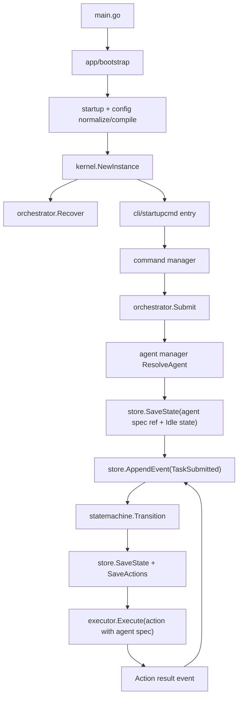

# 事件驱动可恢复 ReAct 架构重构引导

本文档用于指导后续分步重构。目标不是照搬 Xray-core 的目录结构，而是借鉴它的代码架构理念：用运行时内核管理模块生命周期，用稳定接口隔离能力，用配置编译出运行对象，用调度器统一推进流程，用本地状态和事件日志保证可恢复。

当前项目仍以 `internal/app` 装配同步 `NativeLoop` 为主。后续重构应逐步演进到“本地持久化状态机 + Orchestrator + 事件驱动 Executor”的结构。

## 一、架构目标

重构后的系统应满足以下目标：

- CLI、启动命令、未来 HTTP/MCP 等入口都只负责接收输入，不直接驱动 agent loop。
- agent 不再持有写死的同步循环，而是由状态机定义 ReAct 流程。
- Orchestrator 是流程总控，负责加载状态、消费事件、调用状态机、派发动作。
- StateMachine 是纯状态迁移逻辑，不做 IO，不调用模型，不执行工具。
- Executor 只执行副作用，并把执行结果转换为事件。
- Store 是运行状态事实来源，内存只作为缓存。
- 每一步都可以持久化、恢复、重试、审计。

## 二、生命周期分层

后续所有包和对象都应按生命周期归类，避免把全局静态对象和运行态状态混在一起。

| 生命周期 | 含义 | 典型对象 | 是否可全局复用 |
| --- | --- | --- | --- |
| 全局静态 | 不含用户、session、run、turn 信息，进程内可共享 | 接口、常量、schema、agent spec、prompt 模板、provider request builder、命令定义 | 可以 |
| Instance 级 | 由配置编译后生成，配置不变时可复用 | `kernel.Instance`、model manager、tool manager、policy evaluator、command manager、workspace manager | 同一 instance 内可复用 |
| Runtime 级 | 跟随一次 run/session/request 变化 | runtime scope、run state、session scope、agent runtime、history | 不可全局复用 |
| Turn/Action 级 | 跟随单步状态迁移变化 | prompt output、LLM request、tool call、approval request、action result | 不可复用 |

判断规则：

- 包内只有类型、接口、规则、builder，通常是全局静态。
- 对象里有 `session_id`、`run_id`、`turn_id`、history、event scope、用户输入、工作目录快照，就是 runtime。
- 对象依赖配置但不依赖具体 session，例如模型 endpoint、tool catalog、policy mode，是 instance 级。
- `llmClient` 应是 instance 级服务；debug/session trace 不应绑进 client 本体，应通过 runtime scope 或 middleware 注入。
- agent 应拆成静态 `AgentSpec` 和动态 `AgentRuntime`。当前 concrete agent 同时混合了两者，后续需要拆开。

## 三、目标包编排

下面是建议的目标包职责。实际迁移可以分阶段，不要求一次性改成这个形态。

```text
internal/
  app/              兼容期启动入口，逐步缩小为 bootstrap
  kernel/           运行时内核，持有 instance 和模块生命周期
  runtime/          单次执行的 scope/context，替代当前 content 的命名和职责
  orchestrator/     事件驱动流程总控
  statemachine/     纯 ReAct 状态机
  event/            事件类型、事件 envelope、本地事件队列接口
  store/            本地事件日志、状态快照、action outbox、artifact 存储
  executor/         副作用执行器，把 action 执行为 result event
  agent/            agent spec、agent registry、agent manager
  prompt/           prompt builder 和 prompt 策略
  llm/              模型调用抽象、模型 manager、provider client
  tools/            tool contract、tool manager、具体工具实现
  workspace/        workspace manager 和本地文件系统实现
  audit/            可选的用户可读会话记录和审计视图
  policy/           工具风险评估和审批策略
  command/          命令定义、命令 manager
  cli/              交互式入口适配
  startup/          启动参数解析
  startupcmd/       非交互启动命令入口适配
  config/           配置文件读取、归一化、编译输入
  logging/          日志接口和默认实现
```

## 四、包边界和对外服务

### `internal/app`

边界范围：

- 保留当前兼容入口 `Run`。
- 负责把 `main.go` 传入的参数交给 startup/config/kernel。
- 重构后不继续承担业务装配中心职责。

对外服务：

- `Run(ctx, args, in, out, errOut) error`

生命周期：

- 启动适配层。
- 不应持有长期运行态状态。

不应承担：

- agent 选择规则。
- tool registry 创建细节。
- LLM provider 装配细节。
- 状态机推进逻辑。

### `internal/kernel`

边界范围：

- 运行时内核。
- 根据已归一化配置创建 `Instance`。
- 管理模块注册、模块依赖、启动、恢复、关闭。

对外服务：

- `NewInstance(config) (*Instance, error)`
- `Instance.Start(ctx) error`
- `Instance.Close(ctx) error`
- `Instance.Orchestrator()`
- `Instance.Commands()`
- `Instance.Models()`
- `Instance.Tools()`
- `Instance.Store()`

生命周期：

- Instance 级。
- 配置变更时重建。

不应承担：

- 具体 LLM HTTP 请求。
- 具体工具逻辑。
- 状态机 transition 细节。
- CLI 输入循环。

### `internal/runtime`

边界范围：

- 定义运行态 scope。
- 替代当前 `content.Env` 的“运行态上下文”角色。
- 承载 request/session/run/turn/action 的当前上下文。

对外服务：

- `Scope`
- `WithScope(ctx, scope)`
- `ScopeFromContext(ctx)`
- `WithUpdatedScope(ctx, update)`

生命周期：

- Runtime 级。
- 每个 run/session/turn/action 都可以派生自己的 scope。

应包含：

- IO 引用。
- `run_id`、`session_id`、`turn_id`。
- 当前 agent 名称。
- 当前 workdir。
- 当前 event scope。
- 当前用户可见输出通道。

不应包含：

- 具体业务逻辑。
- 全局 mutable registry。
- 具体 agent/tool/model 实现。

### `internal/orchestrator`

边界范围：

- 事件驱动流程总控。
- 接收入口提交的任务。
- 从 store 加载 run state。
- 把 event 交给 statemachine。
- 保存新状态和待执行 action。
- 通知 executor 执行动作。

对外服务：

- `Submit(ctx, request) (RunRef, error)`
- `HandleEvent(ctx, event) error`
- `Recover(ctx) error`
- `Cancel(ctx, runID) error`
- `Pause(ctx, runID) error`
- `Resume(ctx, runID) error`

生命周期：

- Instance 级服务。
- 处理的是 Runtime 级状态。

不应承担：

- 不直接调用 LLM。
- 不直接执行工具。
- 不直接写 workspace 文件。
- 不直接拼 prompt。

### `internal/statemachine`

边界范围：

- 纯 ReAct 状态机。
- 输入当前状态和事件，输出新状态和 action intent。
- 必须可单元测试，不依赖文件系统、网络、终端。

对外服务：

- `Transition(state, event) (nextState, actions, error)`
- 状态类型定义。
- action intent 类型定义。

生命周期：

- 全局静态逻辑。
- 具体 state 是 Runtime 级数据。

不应承担：

- IO。
- 调模型。
- 调工具。
- 写 session。
- 读配置文件。

### `internal/event`

边界范围：

- 定义事件模型。
- 定义事件 envelope、sequence、correlation id、causation id。
- 定义事件队列接口。

对外服务：

- `Event`
- `Envelope`
- `Bus`
- `Publisher`
- `Subscriber`

生命周期：

- 事件类型和 schema 是全局静态。
- 事件实例是 Runtime/Action 级。

事件命名建议：

- `TaskSubmitted`
- `PromptBuilt`
- `ModelCompleted`
- `ModelFailed`
- `ToolRequested`
- `ToolCompleted`
- `ToolFailed`
- `PolicyApprovalRequested`
- `PolicyApprovalResolved`
- `UserInputRequested`
- `UserInputReceived`
- `RunPaused`
- `RunResumed`
- `RunCancelled`
- `RunCompleted`
- `RunFailed`

### `internal/store`

边界范围：

- 本地持久化事实来源。
- 保存 event log、state snapshot、action outbox、artifact。
- 支持断点恢复。

对外服务：

- `AppendEvent(ctx, runID, event) error`
- `LoadState(ctx, runID) (RunState, error)`
- `SaveState(ctx, runID, state) error`
- `SaveActions(ctx, runID, actions) error`
- `ClaimAction(ctx) (ActionLease, error)`
- `CompleteAction(ctx, actionID, resultEvent) error`
- `ListRecoverableRuns(ctx) ([]RunRef, error)`
- `SaveArtifact(ctx, ref, data) error`
- `LoadArtifact(ctx, ref) ([]byte, error)`

生命周期：

- Store 服务是 Instance 级。
- Store 中保存的数据是 Runtime 级。

不应承担：

- 不解释业务状态。
- 不决定下一步动作。
- 不执行 action。

建议本地布局：

```text
.testAgent/
  runs/
    <run-id>/
      state.json
      events.jsonl
      actions.jsonl
      artifacts/
        prompt-0001.json
        llm-request-0001.json
        llm-response-0001.json
        tool-call-0001.json
        tool-result-0001.json
```

### `internal/executor`

边界范围：

- 执行状态机输出的 action intent。
- 每种副作用一个 executor 或 handler。
- 执行完成后只产出事件，不直接推进状态机。

对外服务：

- `Execute(ctx, action) (event.Event, error)`
- action handler registry。

生命周期：

- Executor manager 是 Instance 级。
- action 执行上下文是 Action 级。

典型 action：

- `BuildPrompt`
- `CallModel`
- `ExecuteTool`
- `AskUser`
- `RequestPolicyApproval`
- `WriteArtifact`
- `EmitFinalOutput`

不应承担：

- 不持久化状态机状态。
- 不决定 ReAct 下一步。
- 不直接改变 run state。

### `internal/agent`

边界范围：

- 定义 agent spec。
- 管理 agent registry。
- 根据 run scope 选择 agent spec。
- 不再持有写死循环。

对外服务：

- `AgentSpec`
- `AgentRegistry`
- `AgentManager`
- `ResolveAgent(ctx, request) (AgentSpec, error)`

生命周期：

- `AgentSpec` 是全局静态或 Instance 级。
- `AgentRuntime` 如保留，应是 Runtime 级。

建议拆分：

- `AgentSpec`：name、description、prompt strategy、默认 tool set、默认 model、max steps。
- `AgentManager`：根据 request/config/routing 选择 spec。
- `AgentRuntime`：只保存当前 run/session 相关临时状态，不作为事实来源。

不应承担：

- 不创建 tool registry。
- 不直接调用 LLM。
- 不直接写 session。
- 不直接执行 workspace 文件操作。

### `internal/prompt`

边界范围：

- prompt 策略和 prompt builder。
- 把 task、history、tool definitions、workspace summary 等输入转换为模型消息。

对外服务：

- `Builder`
- `Build(ctx, input) (Output, error)`
- prompt strategy registry。

生命周期：

- prompt 模板和 builder 类型是全局静态。
- builder 实例通常是 Instance 级或 AgentSpec 级。
- prompt output 是 Action 级 artifact。

不应承担：

- 不调用模型。
- 不执行工具。
- 不保存 session。
- 不推进状态机。

### `internal/llm`

边界范围：

- 模型调用抽象和 provider client。
- 后续可加入 model manager，负责按 AgentSpec/RunScope 选择模型客户端。

对外服务：

- `Client`
- `Request`
- `Response`
- `ModelManager`
- `ProviderFactory`

生命周期：

- provider request builder 是全局静态。
- `Client` 是 Instance 级，配置不变可复用。
- `Request`/`Response` 是 Action 级。

重要约束：

- `Client` 不应绑定 session debug recorder。
- request/response tracing 应通过 executor/store/session 记录。

不应承担：

- 不知道 agent loop。
- 不知道 tool registry。
- 不读 CLI 输入。

### `internal/tools`

边界范围：

- 工具接口、工具定义、工具 manager、具体工具实现。
- 统一处理工具执行前后的 policy 和 event 记录。

对外服务：

- `Tool`
- `ToolDefinition`
- `ToolManager`
- `ResolveToolSet(agentSpec, scope)`
- `Execute(ctx, toolCall) (ToolResult, error)`

生命周期：

- tool schema 和 tool factory 是全局静态。
- tool manager 是 Instance 级。
- tool call/result 是 Action 级。

不应承担：

- 不决定 agent 下一步。
- 不直接推进状态机。
- 不把用户确认逻辑散落在具体工具内。

### `internal/workspace`

边界范围：

- 工作区解析、路径安全、文件读取、搜索、snapshot。
- 后续应从工具内部临时创建，转为由 workspace manager 管理。

对外服务：

- `Workspace`
- `WorkspaceManager`
- `Resolve(scope.WorkDir)`
- `List`
- `Read`
- `Search`
- `Snapshot`

生命周期：

- 路径规则和忽略规则是全局静态。
- workspace manager 是 Instance 级。
- 具体 workspace view 跟随 runtime workdir。

不应承担：

- 不做 policy 判断。
- 不做用户确认。
- 不保存 session。
- 不知道 agent。

### 用户可读审计视图（可选）

边界范围：

- 用户可读会话记录、审计日志、usage 汇总。
- 可以从 runtime event store 投影生成 JSONL 或其他视图。
- 不应作为运行恢复的事实来源。

对外服务：

- runtime event projection
- audit log exporter
- usage summary exporter

生命周期：

- audit projector 是 Instance 级。
- audit record 是 Runtime 级。

和 `store` 的关系：

- `store` 是恢复流程的事实来源。
- 审计视图面向用户和调试。
- 长期可以让审计 projector 订阅事件流生成用户可读视图。

### `internal/policy`

边界范围：

- 风险判断和审批策略。
- 只返回 allow/deny/ask，不执行确认。

对外服务：

- `Evaluator`
- `Check(request) Result`
- policy mode parser。

生命周期：

- policy 规则是全局静态。
- evaluator 是 Instance 级。
- policy request/result 是 Action 级。

不应承担：

- 不读终端。
- 不调用 ask_user。
- 不执行工具。

### `internal/command`

边界范围：

- 命令定义、命令 manager。
- 命令把用户意图转换成 orchestrator request 或 instance 查询。

对外服务：

- `Command`
- `Registry`/`Manager`
- `Execute(ctx, name, args)`

生命周期：

- 命令定义是全局静态。
- command manager 是 Instance 级。
- 命令执行上下文是 Runtime 级。

不应承担：

- 不直接调用 concrete agent。
- `run` 命令应提交 orchestrator，而不是直接 `Agent.Run`。

### `internal/cli`

边界范围：

- 交互式入口适配。
- 负责读取用户输入、展示输出、处理 `/exit`、slash command 解析。

对外服务：

- `Run(ctx, instance, io) error`

生命周期：

- CLI session 是 Runtime 级。

不应承担：

- 不知道具体 agent 类型。
- 不直接调 LLM。
- 不直接执行工具。
- 不保存 ReAct 状态。

### `internal/startup` 和 `internal/startupcmd`

边界范围：

- `startup` 只解析 flags 和命令。
- `startupcmd` 是非交互入口适配，最终也应走 command manager 或 orchestrator。

对外服务：

- `startup.Parse(args)`
- `startupcmd.Run(ctx, instance, cfg)`

生命周期：

- 启动期。

不应承担：

- 不读取配置文件。
- 不创建 provider。
- 不创建 session。
- 不直接执行 agent loop。

### `internal/config`

边界范围：

- 配置文件读取、字段校验、配置归一化输入。
- 后续可以增加“配置编译”步骤，把用户配置变成 kernel config。

对外服务：

- `LoadOptional(path)`
- `Normalize(cliConfig, fileConfig)`
- `Compile(normalized) (kernel.Config, error)`

生命周期：

- 配置 schema 是全局静态。
- 编译出的 config 是 Instance 级。

不应承担：

- 不创建 runtime 对象。
- 不直接 new provider。
- 不保存用户 session。

### `internal/logging`

边界范围：

- 日志接口和默认实现。
- 日志是基础设施，不是业务事件。

对外服务：

- `Logger`
- `ParseLevel`
- `New`

生命周期：

- logger 实例是 Instance 级。

不应承担：

- 不代替 session event。
- 不代替 store event log。

## 五、Agent 和 Orchestrator 的位置

Agent 没有被取消。重构后 Agent 从“自己持有同步循环的执行对象”变成“可编排的策略单元”。Orchestrator 也不是替代 Agent，而是负责调度 Agent 策略、状态机和执行器。

两者的边界如下：

| 角色 | 负责什么 | 不负责什么 |
| --- | --- | --- |
| Agent | 定义任务策略：prompt strategy、默认模型、可用工具集、max steps、输出约束 | 不直接循环、不直接调模型、不直接执行工具、不直接保存恢复状态 |
| Orchestrator | 接收任务、创建 run、恢复状态、消费事件、调用状态机、派发 action | 不定义 agent 策略、不拼具体 prompt、不执行工具、不直接发 HTTP |
| StateMachine | 根据当前 run state 和 event 推导下一状态与 action | 不查 registry、不读配置、不做 IO |
| Executor | 执行 action，例如 build prompt、call model、execute tool | 不决定下一步 ReAct 流程 |

推荐关系：

```text
Orchestrator
  -> AgentManager.ResolveAgent(request)
  -> 得到 AgentSpec
  -> 把 AgentSpecRef / AgentPlan 写入 RunState
  -> StateMachine 根据 RunState 推进流程
  -> Executor 执行 action 时读取 AgentSpec 对应的 prompt/model/tool policy
```

`AgentSpec` 是全局静态或 Instance 级配置对象；`RunState` 中只保存 agent 的引用、快照或版本号，避免恢复时 agent 定义漂移导致行为不可解释。

一个 AgentSpec 至少应描述：

- `name`
- `description`
- `prompt_strategy`
- `default_model`
- `tool_set`
- `max_steps`
- `stop_policy`
- `output_policy`

一个 RunState 至少应记录：

- `run_id`
- `session_id`
- `agent_name`
- `agent_spec_version`
- `status`
- `step_index`
- `history_refs`
- `pending_actions`
- `last_event_id`

所以目标主链路不是“Orchestrator 取代 Agent”，而是：

```text
入口提交任务
  -> Orchestrator 创建 run
  -> AgentManager 选择 AgentSpec
  -> Store 保存 RunState(agent spec ref + 当前状态)
  -> StateMachine 推进 ReAct 状态
  -> Executor 按 AgentSpec 执行 prompt/model/tool action
  -> 新事件回到 Orchestrator
```

## 六、主流程

目标主流程如下：



入口层只提交请求。流程推进由事件完成。

## 七、事件驱动 ReAct 状态机

### 状态定义

建议先定义最小可用状态集：

| 状态 | 含义 |
| --- | --- |
| `Idle` | run 已创建但还未开始 |
| `BuildingPrompt` | 正在构造 prompt |
| `CallingModel` | 正在等待模型返回 |
| `InspectingModelOutput` | 已拿到模型结果，准备判断 final 或 tool call |
| `ExecutingTool` | 正在等待工具执行结果 |
| `WaitingPolicyApproval` | 等待用户确认风险动作 |
| `WaitingUserInput` | 等待用户补充信息 |
| `Paused` | 用户或系统暂停 |
| `Completed` | run 正常完成 |
| `Failed` | run 失败且不可继续 |
| `Cancelled` | run 被取消 |

### 事件到动作的迁移

| 当前状态 | 输入事件 | 新状态 | 输出 action |
| --- | --- | --- | --- |
| `Idle` | `TaskSubmitted` | `BuildingPrompt` | `BuildPrompt` |
| `BuildingPrompt` | `PromptBuilt` | `CallingModel` | `CallModel` |
| `CallingModel` | `ModelCompleted` | `InspectingModelOutput` | `InspectModelOutput` 或内部纯判断 |
| `InspectingModelOutput` | `ToolRequested` | `ExecutingTool` 或 `WaitingPolicyApproval` | `ExecuteTool` 或 `RequestPolicyApproval` |
| `InspectingModelOutput` | `FinalAnswerReady` | `Completed` | `EmitFinalOutput` |
| `WaitingPolicyApproval` | `PolicyApprovalResolved` | `ExecutingTool` 或 `Failed` | `ExecuteTool` 或 `EmitFailure` |
| `ExecutingTool` | `ToolCompleted` | `CallingModel` | `CallModel` |
| `ExecutingTool` | `ToolFailed` | `CallingModel` 或 `Failed` | `CallModel` 或 `EmitFailure` |
| `WaitingUserInput` | `UserInputReceived` | `CallingModel` | `CallModel` |
| 任意非终态 | `RunPaused` | `Paused` | 无 |
| `Paused` | `RunResumed` | 恢复到暂停前状态 | 继续 pending action |
| 任意非终态 | `RunCancelled` | `Cancelled` | 尝试取消 pending action |

### ReAct 映射

ReAct 的 Reason/Act/Observe 不再通过同步循环表达，而是通过事件表达：

- Reason：`CallModel` action，结果是 `ModelCompleted`。
- Act：模型返回 tool call 后产生 `ExecuteTool` action。
- Observe：工具结果变成 `ToolCompleted` event，并进入下一次 `CallModel`。
- Finish：模型无 tool call 且给出最终回答，进入 `Completed`。

原来的：

```text
for step := 1; step <= maxSteps; step++ {
  call model
  if tool calls {
    execute tools
    continue
  }
  finish
}
```

应演进为：

```text
ModelCompleted
  -> 状态机判断有 tool call
  -> 保存 ExecuteTool action
  -> executor 执行工具
  -> ToolCompleted
  -> 状态机产生下一次 CallModel action
```

## 八、本地持久化和断点恢复

### 持久化内容

每个 run 至少保存四类数据：

| 数据 | 作用 |
| --- | --- |
| event log | 完整历史，可回放、审计、debug |
| state snapshot | 快速恢复当前状态 |
| action outbox | 保存已计划但未完成的副作用 |
| artifacts | 保存 prompt、LLM request/response、tool input/output 等大对象 |

### 写入顺序

Orchestrator 处理事件时应遵守顺序：

1. 读取当前 state。
2. append 输入 event。
3. 调用 state machine。
4. 保存 next state。
5. 保存 action outbox。
6. 提交事务或确保上述写入具备一致性。
7. 通知 executor。

如果本地实现暂时没有事务，也要保证至少满足：

- event 已写但 state 未写：恢复时可以 replay event 重建 state。
- state 已写但 action 未写：恢复时可以由 state 重新计算缺失 action，或标记 run 需要 reconciliation。
- action 已写但未执行：恢复时 executor 可以继续 claim。

### action 幂等

每个 action 必须有稳定 `action_id`：

```text
action_id = run_id + step_index + action_kind + sequence
```

Executor 执行前先 claim action，执行后写 completion event。

对不同副作用的幂等要求：

- `BuildPrompt`：纯本地计算，可重复。
- `CallModel`：可能产生费用，不应盲目重复。执行前保存 request artifact，执行后保存 response artifact。恢复时如果 request 已发出但没有 response，需要标记为 unknown 或按 provider 能力使用 idempotency key。
- `ExecuteTool`：读工具可重复；写工具必须分 dry-run/apply 两阶段，并记录 action id。
- `AskUser`：可重复展示，但需要用同一个 question id 合并答案。
- `EmitFinalOutput`：可以重复生成，但 CLI 展示层要避免重复打印已确认输出。

### 恢复流程

`orchestrator.Recover(ctx)` 应做：

1. `store.ListRecoverableRuns()` 找出非终态 run。
2. 优先读取 `state.json`。
3. 如果 state 缺失或版本不匹配，从 `events.jsonl` replay。
4. 找出 pending/running action。
5. 对可安全重试 action 重新入队。
6. 对未知结果 action 标记为 `NeedsReconciliation`，由状态机决定重试、等待用户或失败。
7. 恢复完成后继续消费新事件。

断点恢复的核心不是“内存继续跑”，而是“从本地事实重新推导下一步”。

## 九、当前 `NativeLoop` 的迁移方式

不要直接删除 `NativeLoop`。建议分阶段迁移。

### 阶段 1：保持 `NativeLoop`，补齐边界

- 新增架构接口和文档边界。
- 明确 `AgentSpec` 和 `AgentRuntime` 概念。
- 禁止继续把更多职责塞入 `NativeLoop`。

### 阶段 2：引入 store/event，但 `NativeLoop` 仍作为单个 action

可以先把一次 `NativeLoop.Run` 包装成：

```text
TaskSubmitted
  -> ExecuteNativeLoop action
  -> NativeLoopCompleted / NativeLoopFailed
```

这样先建立持久化 run 和事件日志，不立即拆内部循环。

### 阶段 3：拆 prompt 和 model step

把 `NativeLoop` 中的：

- prompt build
- context build
- model request
- model response

拆成独立 action/event。

### 阶段 4：拆 tool step

把工具调用拆成：

- `ToolRequested`
- `PolicyApprovalRequested`
- `ToolCompleted`
- `ToolFailed`

此时 ReAct 主循环已由状态机推进。

### 阶段 5：移除同步 loop

当 prompt、model、tool、final output 都事件化后，`NativeLoop` 可以退化为兼容层或删除。

## 十、全局静态与 runtime 包分类

| 包 | 生命周期分类 | 说明 |
| --- | --- | --- |
| `startup` | 全局静态/启动期 | 解析逻辑静态，解析结果是启动期数据 |
| `config` | 全局静态/Instance 输入 | schema 静态，编译结果跟随 instance |
| `command` | 命令定义静态，manager Instance 级 | 命令执行上下文是 runtime |
| `agent` | spec 静态，runtime 动态 | 不应再让 agent 实例混合 session/history |
| `prompt` | 模板静态，output action 级 | builder 可 instance 级 |
| `llm` | client Instance 级，request/response action 级 | client 不绑定 session |
| `tools` | tool 定义静态，manager Instance 级，call action 级 | tool call/result 动态 |
| `workspace` | manager Instance 级，workspace view runtime 级 | workdir 跟随 run scope |
| `policy` | 规则静态，evaluator Instance 级，decision action 级 | 用户确认是事件 |
| `session` | manager Instance 级，records runtime 级 | 审计记录，不是恢复事实源 |
| `store` | service Instance 级，数据 runtime 级 | 恢复事实源 |
| `event` | schema 静态，event runtime 级 | 所有流程推进都靠 event |
| `statemachine` | 逻辑静态，state runtime 级 | 纯函数 |
| `orchestrator` | service Instance 级 | 管理 runtime state，不把 state 只放内存 |
| `executor` | service Instance 级，action runtime 级 | 执行副作用 |
| `runtime` | runtime 级 | 不允许全局复用 |
| `cli` | runtime 级入口 | 不保存事实状态 |
| `app` | 启动期兼容层 | 逐步缩小 |
| `logging` | Instance 级 | 不代替事件日志 |

## 十一、重构约束

后续改代码时应遵守：

- 新增复杂流程优先落到 orchestrator/statemachine/event/store，而不是继续扩展 `NativeLoop`。
- 新增副作用优先建 action + executor，不让状态机直接做 IO。
- 新增可恢复数据必须进入 store，不只写 session。
- 新增用户等待点必须变成 `WaitingUserInput` 或 `WaitingPolicyApproval`，不能阻塞在深层函数里。
- 新增模型调用必须保存 request/response artifact。
- 新增工具写操作必须考虑 action id 和幂等。
- 包级全局 registry 只能存静态能力，不能存当前用户、当前 session、当前 run。
- runtime scope 只能通过 context 或明确参数传递，不能从全局变量读取。

## 十二、推荐分步路线

### 第一步：文档和命名边界

- 保留现有代码。
- 新增本架构引导。
- 后续再把 `content` 的职责逐步迁移为 `runtime` 概念。

### 第二步：引入 `store` 和 `event`

- 定义 run id、event envelope、state snapshot。
- 当前 `session` 继续保留。
- 新任务先写 event log，再调用现有执行链路。

### 第三步：引入 `orchestrator`

- `command run` 和 CLI 普通输入不再直接调用 `Agent.Run`。
- 改为提交 `TaskSubmitted`。
- Orchestrator 暂时用 `ExecuteNativeLoop` action 兼容当前实现。

### 第四步：引入 `statemachine`

- 定义最小状态集。
- 把 run 状态持久化。
- 支持 pause/resume/cancel 的状态迁移。

### 第五步：拆 `NativeLoop`

- 先拆 prompt/model。
- 再拆 tool/policy/user input。
- 最后让状态机完全驱动 ReAct。

### 第六步：完善恢复能力

- 启动时自动 `Recover`。
- pending action 继续执行。
- running unknown action 进入 reconciliation。
- artifact 和 event log 支持定位失败点。

### 第七步：清理旧边界

- `app.Run` 只保留 bootstrap。
- `agent` 不再自己创建 tool registry。
- `llmClient` 不再绑定 session debug。
- `workspace.New` 不再散落在工具里临时创建。

## 十三、最终判断标准

完成重构后，应能回答这些问题：

- 任意 run 当前处于哪个状态？
- 当前等待什么事件？
- 已经计划了哪些 action？
- 哪些 action 执行过，结果是什么？
- 进程崩溃后从哪个 event/action 恢复？
- 某个 agent 的静态定义是什么？
- 某次执行的 runtime scope 是什么？
- 模型请求和工具调用的 artifact 在哪里？

如果这些问题只能靠内存对象或调用栈回答，说明还没有达到事件驱动、可持久化、可恢复的目标。
