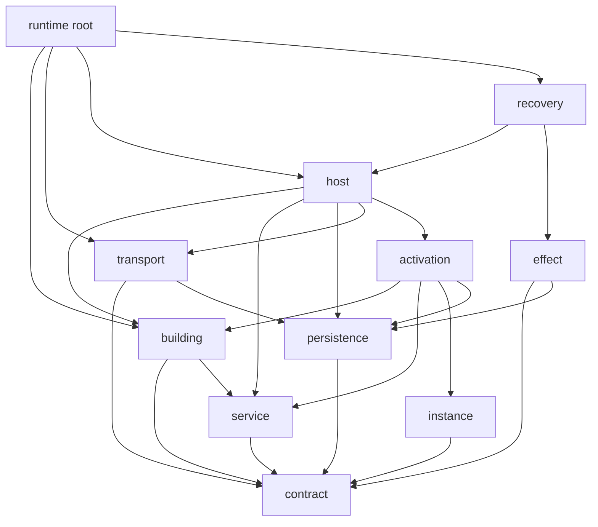
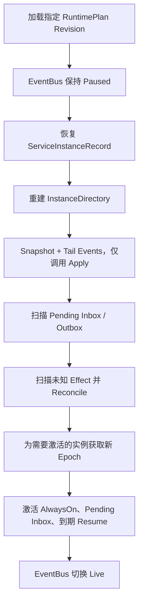

# Event-Sourced Service Runtime 接口与结构设计

> 状态：待评审设计稿，不代表已经进入实现  
> 日期：2026-07-15  
> 输入依据：`localDocs/event-sourced-service-runtime-architecture.md`  
> 范围：只设计 Runtime 框架，不设计依赖 EventBus 的业务子服务

## 1. 本文要解决的问题

本文把目标架构中的 Runtime 收敛为一组明确的接口、数据结构和对象关系，供实现前评审。

Runtime 在这里是通用的事件溯源服务运行平台，负责：

- 构建期注册、校验和编译不可变 `RuntimePlan`。
- 维护可序列化的跨服务消息协议。
- 托管服务实例，但不理解具体服务的业务语义。
- 通过 Inbox、Journal、Snapshot、Outbox 和 Effect Store 持久化运行事实。
- 以原子提交边界处理单条 Inbox 消息。
- 管理通用服务实例生命周期、激活、消失、租约和 Fencing。
- 路由、可靠投递、ACK、Retry 和 Dead Letter。
- 从 Snapshot 与 Journal 恢复服务业务状态。
- 恢复未完成的消息、Outbox 和外部 Effect。
- 记录可观测的 Runtime 事件。

## 2. 明确不在本文设计的内容

以下组件是将来挂载到 Runtime 上的服务，不属于 Runtime 框架本身：

- `TaskService`、Task 状态机和具体 Task 消息。
- `Agent Service`、`AgentSupervisor`、Agent fork 策略和 Agent 业务状态。
- `CapabilityService`、内部授权规则、Capability Provider 和具体 Tool/MCP Executor。
- `ApprovalService` 和人工审批业务规则。
- `Model Service` 和模型供应商协议。
- `Orchestrator Service`、Goal、Saga 和多响应聚合。
- `Memory Service`。
- Knowledge、RAG、Embedding、Vector、Document 和 Rerank 服务。
- 上述服务的 Message Payload、Domain Event 和 Snapshot Schema。

Runtime 只为这些服务提供 `Service`、`ServiceFactory`、Message、Effect、存储和生命周期端口，不在核心代码中出现服务名称分支。

## 3. 核心设计结论

### 3.1 Runtime 只持有基础设施，不直接持有业务服务

顶层 `Runtime` 可以持有 `RuntimePlan`、`ServiceHost`、`EventBus`、`ActivationManager`、存储和恢复协调器，但不能出现：

```go
agent       *Agent
policy      *Policy
model       *ModelClient
capability  *ToolRegistry
```

具体服务实例只存在于 `ActivationManager` 的临时 Activation 中，可被 Passivate，也不能成为 Runtime 的静态字段。

### 3.2 静态定义、部署计划和动态实例必须分开

```text
ServiceDefinition
  构建期定义：实现类型、Factory、协议、Schema、依赖声明

RuntimePlan
  编译结果：本次部署挂载了什么、地址是什么、如何路由

ServiceInstanceRecord
  运行期事实：某个逻辑实例、Mailbox、Stream、生命周期和 Epoch

Activation
  当前进程内的临时对象：Service、恢复后的 State、Lease
```

### 3.3 RuntimePlan 必须真正不可变

`RuntimePlan` 不应暴露可修改的 slice、map 或 `json.RawMessage`。Go 结构建议使用私有字段，查询方法返回副本。

### 3.4 单条消息提交使用一个原子端口

ServiceHost 不直接编排多个相互独立的写接口来假装原子性，而是调用一个 `MessageCommitStore.CommitMessage`：

```text
Inbox ACK
+ Journal Append(expectedSequence)
+ Snapshot
+ Outbox
+ Effect Records
+ ActivationEpoch fencing check
```

具体存储实现可以使用 SQLite/SQL 事务。无法提供事务的实现仍必须利用稳定 ID、Inbox 去重和乐观并发满足幂等重试。

### 3.5 Service 的 Live 与 Replay 路径严格分开

- `Handle` 只在处理新 Inbox 消息时调用，返回声明式 `Decision`。
- `Apply` 只根据已持久化事件更新状态，必须是确定性的纯函数。
- 恢复时不调用 `Handle`，也不再次执行 Outgoing 或 Effect。

### 3.6 核心校验保持通用

Register 只内置通用校验。Agent 引用、Capability Selector、Model 引用等校验由对应模块注册 `PlanValidator` 完成，Runtime 核心中禁止出现：

```go
if service.Type == "agent" { ... }
if message.Type == "capability.invoke" { ... }
```

## 4. 建议的逻辑包边界

本文先确认逻辑边界，不要求评审通过前立即迁移当前代码目录。

```text
internal/runtime/
  contract/       可序列化 ID、Message、StoredEvent 等基础协议
  service/        Service、Factory、Decision 和 State 协议
  building/       Register、Manifest、Plan、RoutingTable、编译校验
  persistence/    Journal/Snapshot/Inbox/Outbox/Effect/Commit 存储端口
  transport/      EventBus、Router、AddressResolver 和投递协议
  instance/       ServiceInstance、生命周期、Directory、Lease
  activation/     ActivationManager 和进程内 Activation
  effect/         EffectWorker、Executor、Reconciler
  host/           ServiceHost 和单消息处理闭环
  recovery/       启动恢复与 Reconciliation 协调
  observability/  RuntimeEvent 和 Recorder
```

依赖方向：



约束：下层包不能反向导入 `runtime` 根包；业务服务只能依赖 `contract` 和 `service` 等必要协议，不能依赖 ServiceHost 的具体实现。

## 5. 基础标识和消息协议

### 5.1 强类型标识

```go
type RuntimeID string
type PlanRevision string

type ServiceType string
type ServiceAddress string
type ServiceInstanceID string
type MailboxID string

type StreamID string
type MessageType string
type EventType string
type EffectType string

type ComponentRef struct {
    Type    ServiceType `json:"type" yaml:"type"`
    Version string      `json:"version" yaml:"version"`
}
```

`ComponentRef` 表示静态实现，例如 `agent.static@v1`；`ServiceAddress` 表示本次部署中的逻辑地址，例如 `agent.personal`。两者不能混用。

### 5.2 Message

```go
type MessageKind string

const (
    MessageCommand MessageKind = "command"
    MessageQuery   MessageKind = "query"
    MessageEvent   MessageKind = "event"
    MessageReply   MessageKind = "reply"
)

type Message struct {
    ID      string
    Kind    MessageKind
    Type    MessageType
    Version int

    From    ServiceAddress
    To      ServiceAddress
    ReplyTo ServiceAddress

    RuntimeID    RuntimeID
    PlanRevision PlanRevision
    UserID       string
    GoalID       string
    RunID        string

    CorrelationID string
    CausationID   string

    StreamID StreamID
    Sequence uint64

    Deadline *time.Time
    Attempt  int

    Payload  json.RawMessage
    Metadata map[string]string
}
```

约束：

- `ID` 在首次创建时确定，Retry 不改变。
- `CorrelationID` 关联一条业务调用链；`CausationID` 指向直接原因 Message。
- `StreamID + Sequence` 是消息传输顺序，不等同于 Journal Aggregate Sequence。
- `PlanRevision` 在恢复旧 Run 时保持不变。
- Payload 只保存可序列化小对象；大对象使用 `ArtifactRef`。
- Runtime 对所有 Message 做 envelope 校验，但不理解业务 Payload。

```go
type ArtifactRef struct {
    Store       string
    Key         string
    ContentType string
    Checksum    string
    Size        int64
}
```

## 6. 服务处理协议

### 6.1 ServiceState 和 Service

```go
type ServiceState struct {
    SchemaVersion int
    Data          json.RawMessage
}

type ServiceDescriptor struct {
    Component   ComponentRef
    StateSchema SchemaRef
}

type ServiceInit struct {
    RuntimeID     RuntimeID
    PlanRevision  PlanRevision
    InstanceID    ServiceInstanceID
    Address       ServiceAddress
    StateStreamID StreamID
    Config        json.RawMessage
    Metadata      map[string]string
}

type Service interface {
    Descriptor() ServiceDescriptor

    InitialState(
        ctx context.Context,
        input ServiceInit,
    ) (ServiceState, error)

    Handle(
        ctx context.Context,
        state ServiceState,
        message Message,
    ) (Decision, error)

    Apply(
        state ServiceState,
        event StoredEvent,
    ) (ServiceState, error)
}
```

选择 `json.RawMessage` 而不是 `any` 的原因：

- 强制业务状态存在明确序列化边界。
- Snapshot 不依赖具体 Go 类型。
- 服务版本升级时可以显式迁移 Schema。
- Host 不需要理解业务状态。

### 6.2 ServiceFactory

```go
type ServiceCreateRequest struct {
    RuntimeID    RuntimeID
    PlanRevision PlanRevision

    InstanceID   ServiceInstanceID
    Address      ServiceAddress
    Component    ComponentRef
    Config       json.RawMessage
    Metadata     map[string]string
}

type ServiceFactory interface {
    Create(
        ctx context.Context,
        request ServiceCreateRequest,
    ) (Service, error)
}
```

Factory 只重新创建进程资源，不读取其他服务的业务状态。HTTP Client、连接、缓存等通过 Factory 的构建依赖注入，不能持久化进 Snapshot。

### 6.3 Decision

```go
type Decision struct {
    Events   []NewEvent
    Outgoing []OutgoingMessage
    Effects  []PlannedEffect
    Reply    *Reply
}

type NewEvent struct {
    Key      string
    Type     EventType
    Version  int
    Payload  json.RawMessage
    Metadata map[string]string
}

type OutgoingMessage struct {
    Key      string
    Kind     MessageKind
    Type     MessageType
    Version  int

    To       ServiceAddress
    ReplyTo  ServiceAddress
    StreamID StreamID
    Deadline *time.Time

    Payload  json.RawMessage
    Metadata map[string]string
}

type Reply struct {
    Key      string
    Type     MessageType
    Version  int
    Payload  json.RawMessage
    Error    *ReplyError
    Metadata map[string]string
}

type PlannedEffect struct {
    Key            string
    Type           EffectType
    Version        int
    ExecutorRef    string
    IdempotencyKey string
    Payload        json.RawMessage
    Deadline       *time.Time
    Metadata       map[string]string
}
```

`Decision` 中的对象尚未成为持久化事实。ServiceHost 根据输入 Message ID 和 `Key` 派生稳定 ID：

```text
EventID   = Derive("event",  Message.ID, NewEvent.Key)
MessageID = Derive("message", Message.ID, Outgoing.Key)
ReplyID   = Derive("reply",  Message.ID, Reply.Key)
EffectID  = Derive("effect", Message.ID, Effect.Key)
```

同一 Decision 内 `Key` 必须唯一。这样即使服务在提交前崩溃并重新处理同一 Message，也会生成相同 ID。

### 6.4 Host 对 Decision 的通用校验

ServiceHost 在提交前至少检查：

- Key 非空且同类唯一。
- Event、Message、Reply、Effect 类型和版本有效。
- Outgoing 不允许伪造其他 RuntimeID 或 PlanRevision；这些字段由 Host 填充。
- Reply 只能在输入存在 `ReplyTo` 时产生。
- Query 不允许产生 Domain Event 或外部 Effect。
- Deadline 已经过期时不开始新的副作用。
- Effect 的 ExecutorRef 已在当前 Plan 中注册。

## 7. 构建控制面

### 7.1 ServiceDefinition

```go
type SchemaRef struct {
    Name    string
    Version int
}

type ServiceScope string

const (
    ScopeRuntimeSingleton ServiceScope = "runtime_singleton"
    ScopeMounted          ServiceScope = "mounted"
    ScopeVirtual          ServiceScope = "virtual"
)

type ServiceDependency struct {
    Name          string
    Required      bool
    AcceptedTypes []ServiceType
}

type MessageContract struct {
    Kind    MessageKind
    Type    MessageType
    Version int
}

type ServiceDefinition struct {
    Component    ComponentRef
    Factory      ServiceFactory
    Consumes     []MessageContract
    Produces     []MessageContract
    Dependencies []ServiceDependency
    StateSchema  SchemaRef
    ConfigSchema SchemaRef
    Scope        ServiceScope
}
```

`ServiceDefinition` 属于构建期内存对象，包含 Factory；它本身不写入 RuntimePlan。Plan 只保存 `ComponentRef`。

### 7.2 RuntimeManifest

```go
type RuntimeSpec struct {
    ID       RuntimeID
    Revision PlanRevision
}

type ServiceMount struct {
    Address      ServiceAddress
    Component    ComponentRef
    Config       json.RawMessage
    Dependencies map[string]ServiceAddress
    Metadata     map[string]string
}

type RouteManifest struct {
    Commands map[MessageType]ServiceAddress
    Queries  map[MessageType]ServiceAddress
    Events   map[MessageType][]ServiceAddress
}

type RecoveryPolicy struct {
    SnapshotEveryEvents uint64
    InboxLease          time.Duration
    OutboxLease         time.Duration
    EffectLease         time.Duration
    ActivationLease     time.Duration
    MaxDeliveryAttempts int
}

type RuntimeManifest struct {
    Runtime  RuntimeSpec
    Services []ServiceMount
    Routes   RouteManifest
    Recovery RecoveryPolicy
}
```

动态 Virtual Service 不在 `Services` 中预先枚举每个实例，但必须存在对应 `ServiceDefinition`，并由受控的 Runtime API 创建 `ServiceInstanceRecord`。

### 7.3 Register 与可扩展校验

```go
type DefinitionResolver interface {
    ResolveDefinition(ref ComponentRef) (ServiceDefinition, bool)
}

type SchemaValidator interface {
    Validate(
        ctx context.Context,
        schema SchemaRef,
        value json.RawMessage,
    ) error
}

type PlanValidator interface {
    ValidatePlan(
        ctx context.Context,
        view CompileView,
    ) []ValidationIssue
}

type Register struct {
    definitions map[ComponentRef]ServiceDefinition
    validators  []PlanValidator
    schemas     SchemaValidator
}

func (r *Register) RegisterService(def ServiceDefinition) error
func (r *Register) RegisterPlanValidator(validator PlanValidator) error
func (r *Register) Compile(ctx context.Context, manifest RuntimeManifest) (*RuntimePlan, error)
```

通用 Compile 校验：

- RuntimeID 和 PlanRevision 非空。
- ServiceAddress 唯一。
- ComponentRef 存在且版本明确。
- Config 通过 ConfigSchema 校验。
- 依赖 binding 完整、类型兼容、目标存在且无环。
- Command/Query 每种类型恰好一个目标。
- Event 订阅目标全部存在，可以为零个订阅者。
- 路由目标声明消费对应消息。
- 同一地址、组件或消息定义不存在非法重复。
- Runtime 核心 Effect 存在 Executor。

业务模块通过 `PlanValidator` 增加自己的静态约束。Register 只调用扩展，不理解扩展内容。

### 7.4 不可变 RuntimePlan

```go
type PlannedService struct {
    Address      ServiceAddress
    Component    ComponentRef
    Config       json.RawMessage
    Dependencies map[string]ServiceAddress
    Metadata     map[string]string
}

type RuntimePlan struct {
    runtime  RuntimeSpec
    services map[ServiceAddress]PlannedService
    routing  RoutingTable
    recovery RecoveryPolicy
}

func (p *RuntimePlan) Runtime() RuntimeSpec
func (p *RuntimePlan) Service(address ServiceAddress) (PlannedService, bool)
func (p *RuntimePlan) Services() []PlannedService
func (p *RuntimePlan) Routing() RoutingTable
func (p *RuntimePlan) Recovery() RecoveryPolicy
```

所有返回值都深拷贝 map、slice 和 RawMessage。Plan 运行后不提供 Mutate 方法。配置变更只能编译新 Revision。

## 8. 路由与 EventBus

### 8.1 RoutingTable

```go
type RoutingTable struct {
    commands map[MessageType]ServiceAddress
    queries  map[MessageType]ServiceAddress
    events   map[MessageType][]ServiceAddress
}

type Router interface {
    Resolve(message Message) ([]ServiceAddress, error)
}
```

路由规则：

- Command/Query：`To` 明确时校验目标，否则查编译路由；结果必须是一个地址。
- Event：按当前 Message 的 PlanRevision 查零到多个订阅地址。
- Reply：按 `To` 定向投递，不进入发布订阅。
- Runtime 恢复旧 Revision 时必须加载旧 RoutingTable，不能使用最新配置替换。

### 8.2 AddressResolver

```go
type DeliveryTarget struct {
    RuntimeID    RuntimeID
    PlanRevision PlanRevision
    Address      ServiceAddress
    InstanceID   ServiceInstanceID
    MailboxID    MailboxID
}

type AddressResolver interface {
    ResolveAddress(
        ctx context.Context,
        runtimeID RuntimeID,
        revision PlanRevision,
        address ServiceAddress,
    ) (DeliveryTarget, error)
}
```

EventBus 只能得到 `DeliveryTarget`，不能取得 `Service` Go 对象。

### 8.3 EventBus

```go
type DeliveryMode string

const (
    DeliveryPaused DeliveryMode = "paused"
    DeliveryLive   DeliveryMode = "live"
    DeliveryDrain  DeliveryMode = "draining"
    DeliveryClosed DeliveryMode = "closed"
)

type EventBus interface {
    Mode() DeliveryMode
    Pause(ctx context.Context) error
    Resume(ctx context.Context) error
    Drain(ctx context.Context) error

    Publish(
        ctx context.Context,
        message Message,
    ) (PublishResult, error)

    DispatchNextOutbox(
        ctx context.Context,
        ownerID string,
    ) (DispatchResult, error)

    Close() error
}

type PublishResult struct {
    MessageID string
    Targets   []DeliveryReceipt
    Duplicate bool
}

type DeliveryReceipt struct {
    Address    ServiceAddress
    InstanceID ServiceInstanceID
    MailboxID  MailboxID
    Accepted   bool
    Duplicate  bool
}

type DispatchResult struct {
    OutboxID string
    MessageID string
    Delivered int
    Duplicate int
    Failed    int
}
```

`Publish` 是外部入口或 Outbox Dispatcher 使用的基础设施 API。具体 Service 的 `Handle` 禁止调用它。

EventBus 的固定职责只有：

- 路由并解析 DeliveryTarget。
- 将消息可靠写入目标 Inbox。
- Claim Outbox、投递、标记完成或安排 Retry。
- 去重、Lease、Attempt、顺序和 Dead Letter。

它不判断 Run/Goal 是否完成，不聚合 Reply，不选择服务策略，不执行补偿。

## 9. 持久化结构和端口

### 9.1 Journal 与 Snapshot

```go
type StoredEvent struct {
    EventID        string
    StreamID       StreamID
    StreamType     string
    Sequence       uint64

    EventType      EventType
    EventVersion   int
    PlanRevision   PlanRevision
    ServiceVersion string

    CorrelationID string
    CausationID   string
    Payload       json.RawMessage
    Metadata      map[string]string
    OccurredAt    time.Time
}

type Snapshot struct {
    StreamID      StreamID
    AggregateType string
    OwnerService  ServiceAddress

    PlanRevision  PlanRevision
    SchemaVersion int
    LastSequence  uint64

    State     json.RawMessage
    Checksum  string
    CreatedAt time.Time
}

type JournalStore interface {
    LoadStream(
        ctx context.Context,
        streamID StreamID,
        afterSequence uint64,
        limit int,
    ) ([]StoredEvent, error)

    Head(
        ctx context.Context,
        streamID StreamID,
    ) (uint64, error)
}

type SnapshotStore interface {
    LoadLatest(
        ctx context.Context,
        streamID StreamID,
    ) (Snapshot, bool, error)
}
```

Journal 的 Append 和 Snapshot 的 Save 不暴露为独立写方法，统一走后面的原子 Commit 端口。

### 9.2 Inbox

```go
type InboxStatus string

const (
    InboxPending    InboxStatus = "pending"
    InboxClaimed    InboxStatus = "claimed"
    InboxAcked      InboxStatus = "acked"
    InboxRetry      InboxStatus = "retry"
    InboxDeadLetter InboxStatus = "dead_letter"
)

type InboxRecord struct {
    InboxID     string
    MailboxID   MailboxID
    InstanceID  ServiceInstanceID
    Message     Message
    Status      InboxStatus

    Attempt     int
    AvailableAt time.Time
    LeaseOwner  string
    LeaseToken  string
    LeaseUntil  *time.Time

    ReceivedAt time.Time
    AckedAt    *time.Time
    LastError  string
}

type InboxClaim struct {
    Record     InboxRecord
    LeaseToken string
}

type InboxStore interface {
    Enqueue(
        ctx context.Context,
        target DeliveryTarget,
        message Message,
    ) (InboxRecord, bool, error)

    ClaimNext(
        ctx context.Context,
        mailboxID MailboxID,
        ownerID string,
        lease time.Duration,
    ) (InboxClaim, bool, error)

    RenewClaim(ctx context.Context, claim InboxClaim, lease time.Duration) error
    ReleaseClaim(ctx context.Context, claim InboxClaim, retryAt time.Time, cause error) error
    MoveToDeadLetter(ctx context.Context, claim InboxClaim, cause error) error
    CountPending(ctx context.Context, mailboxID MailboxID) (int, error)
}
```

正常 ACK 不能单独调用，必须包含在 `CommitMessage` 中。

### 9.3 Outbox

```go
type OutboxStatus string

const (
    OutboxPending   OutboxStatus = "pending"
    OutboxClaimed   OutboxStatus = "claimed"
    OutboxDelivered OutboxStatus = "delivered"
    OutboxRetry     OutboxStatus = "retry"
    OutboxDead      OutboxStatus = "dead_letter"
)

type OutboxRecord struct {
    OutboxID    string
    InstanceID  ServiceInstanceID
    Message     Message
    Status      OutboxStatus

    Attempt     int
    AvailableAt time.Time
    LeaseOwner  string
    LeaseToken  string
    LeaseUntil  *time.Time

    CreatedAt   time.Time
    DeliveredAt *time.Time
    LastError   string
}

type OutboxClaim struct {
    Record     OutboxRecord
    LeaseToken string
}

type OutboxStore interface {
    ClaimNext(ctx context.Context, ownerID string, lease time.Duration) (OutboxClaim, bool, error)
    MarkDelivered(ctx context.Context, claim OutboxClaim, result PublishResult) error
    MarkRetry(ctx context.Context, claim OutboxClaim, retryAt time.Time, cause error) error
    MoveToDeadLetter(ctx context.Context, claim OutboxClaim, cause error) error
    CountPending(ctx context.Context, runtimeID RuntimeID) (int, error)
}
```

Outbox Insert 只允许由 `CommitMessage` 完成。

### 9.4 Effect Store

```go
type EffectStatus string

const (
    EffectPlanned                EffectStatus = "planned"
    EffectStarted                EffectStatus = "started"
    EffectSucceeded              EffectStatus = "succeeded"
    EffectFailed                 EffectStatus = "failed"
    EffectReconciliationRequired EffectStatus = "reconciliation_required"
)

type EffectRecord struct {
    EffectID       string
    InstanceID     ServiceInstanceID
    SourceMessageID string
    Type           EffectType
    Version        int
    ExecutorRef    string
    IdempotencyKey string

    Status      EffectStatus
    Attempt     int
    Payload     json.RawMessage
    Result      json.RawMessage
    LastError   string

    PlannedAt   time.Time
    StartedAt   *time.Time
    CompletedAt *time.Time
    LeaseOwner  string
    LeaseToken  string
    LeaseUntil  *time.Time
}

type EffectStore interface {
    ClaimNext(ctx context.Context, ownerID string, lease time.Duration) (EffectClaim, bool, error)
    MarkStarted(ctx context.Context, claim EffectClaim) error
    MarkSucceeded(ctx context.Context, claim EffectClaim, result json.RawMessage) error
    MarkFailed(ctx context.Context, claim EffectClaim, cause error, retryAt *time.Time) error
    RequireReconciliation(ctx context.Context, claim EffectClaim, cause error) error
    ListUnfinished(ctx context.Context, runtimeID RuntimeID) ([]EffectRecord, error)
}
```

### 9.5 单消息原子 Commit

```go
type InboxAck struct {
    InboxID    string
    MessageID  string
    LeaseToken string
    AckedAt    time.Time
}

type MessageCommit struct {
    RuntimeID       RuntimeID
    PlanRevision    PlanRevision
    InstanceID      ServiceInstanceID
    ActivationEpoch uint64

    Ack              InboxAck
    StreamID         StreamID
    ExpectedSequence uint64

    Events   []StoredEvent
    Snapshot *Snapshot
    Outbox   []OutboxRecord
    Effects  []EffectRecord
}

type CommitResult struct {
    LastSequence    uint64
    Duplicate       bool
    StoredEventIDs  []string
    StoredOutboxIDs []string
    StoredEffectIDs []string
}

type MessageCommitStore interface {
    CommitMessage(
        ctx context.Context,
        commit MessageCommit,
    ) (CommitResult, error)
}
```

Commit 必须同时校验：

- Inbox LeaseToken 仍有效。
- Message 尚未 ACK，或者这是同一提交的幂等重试。
- `ActivationEpoch` 等于实例当前 Epoch。
- Journal Head 等于 `ExpectedSequence`。
- EventID、Outbox MessageID 和 EffectID 不产生冲突事实。

建议的存储总入口：

```go
type RuntimeStorage interface {
    Journal() JournalStore
    Snapshots() SnapshotStore
    Inbox() InboxStore
    Outbox() OutboxStore
    Effects() EffectStore
    Instances() ServiceInstanceStore
    Leases() ActivationLeaseStore
    Committer() MessageCommitStore
    Close() error
}
```

## 10. 服务实例、生命周期和地址目录

### 10.1 ServiceInstanceRecord

```go
type ServiceKind string

const (
    ServiceStatic  ServiceKind = "static"
    ServiceVirtual ServiceKind = "virtual"
)

type ServiceLifecycle string

const (
    ServiceDeclared   ServiceLifecycle = "declared"
    ServiceStarting   ServiceLifecycle = "starting"
    ServiceActive     ServiceLifecycle = "active"
    ServicePassivated ServiceLifecycle = "passivated"
    ServiceRecovering ServiceLifecycle = "recovering"
    ServiceDraining   ServiceLifecycle = "draining"
    ServiceTerminated ServiceLifecycle = "terminated"
    ServiceFailed     ServiceLifecycle = "failed"
)

type ServiceInstanceRecord struct {
    InstanceID ServiceInstanceID
    Address    ServiceAddress
    Kind       ServiceKind

    DefinitionRef ComponentRef
    RuntimeID     RuntimeID
    PlanRevision  PlanRevision

    ParentID ServiceInstanceID
    RootID   ServiceInstanceID
    Depth    int

    MailboxID     MailboxID
    StateStreamID StreamID

    Lifecycle      ServiceLifecycle
    ActivationEpoch uint64
    RecordVersion   uint64

    CreatedAt    time.Time
    UpdatedAt    time.Time
    ActivatedAt  *time.Time
    PassivatedAt *time.Time
    TerminatedAt *time.Time

    LastError string
    Metadata  map[string]string
}
```

`Metadata` 只能保存小型、可序列化的实例索引信息。具体服务业务状态必须在自己的 Event Stream 和 Snapshot 中。

### 10.2 Instance Store

```go
type InstanceQuery struct {
    RuntimeID    RuntimeID
    PlanRevision PlanRevision
    Lifecycle    []ServiceLifecycle
    Kind         *ServiceKind
}

type ServiceInstanceStore interface {
    Create(ctx context.Context, record ServiceInstanceRecord) error
    Get(ctx context.Context, instanceID ServiceInstanceID) (ServiceInstanceRecord, bool, error)
    GetByAddress(
        ctx context.Context,
        runtimeID RuntimeID,
        revision PlanRevision,
        address ServiceAddress,
    ) (ServiceInstanceRecord, bool, error)

    CompareAndSwap(
        ctx context.Context,
        next ServiceInstanceRecord,
        expectedRecordVersion uint64,
    ) error

    List(ctx context.Context, query InstanceQuery) ([]ServiceInstanceRecord, error)
}
```

生命周期变更统一经过 `CompareAndSwap` 或后续专门的 Lifecycle Store，不能由 Service 自己修改。

### 10.3 ActivationLease 与 Fencing

```go
type ActivationLease struct {
    InstanceID ServiceInstanceID
    Epoch      uint64
    OwnerID    string
    LeaseToken string
    AcquiredAt time.Time
    LeaseUntil time.Time
}

type ActivationLeaseStore interface {
    Acquire(
        ctx context.Context,
        instanceID ServiceInstanceID,
        ownerID string,
        duration time.Duration,
    ) (ActivationLease, error)

    Renew(ctx context.Context, lease ActivationLease, duration time.Duration) (ActivationLease, error)
    Release(ctx context.Context, lease ActivationLease) error
    Current(ctx context.Context, instanceID ServiceInstanceID) (ActivationLease, bool, error)
}
```

`Acquire` 必须原子地递增实例 `ActivationEpoch`。Journal Commit、Snapshot 和 Inbox ACK 都必须校验 Epoch，拒绝旧 Activation 迟到写入。

### 10.4 InstanceDirectory

```go
type InstanceDirectory interface {
    AddressResolver

    Register(ctx context.Context, record ServiceInstanceRecord) error
    Remove(ctx context.Context, instanceID ServiceInstanceID) error
    Rebuild(ctx context.Context, records []ServiceInstanceRecord) error
}
```

Directory 可以是持久化 Store 的缓存投影，但 Store 才是事实来源。重启时必须可重建。

## 11. ActivationManager

### 11.1 Activation 是非持久化对象

```go
type Activation struct {
    Instance ServiceInstanceRecord
    Lease    ActivationLease
    Service  Service
    State    ServiceState
    Sequence uint64
}
```

`Service`、Client、goroutine、mutex 和连接都只存在于 Activation，不进入 Snapshot。

### 11.2 接口与依赖

```go
type StateRestorer interface {
    Restore(
        ctx context.Context,
        service Service,
        instance ServiceInstanceRecord,
    ) (RestoredState, error)
}

type RestoredState struct {
    State            ServiceState
    LastSequence     uint64
    SnapshotSequence uint64
    ReplayedEvents   int
}

type Activator interface {
    Activate(
        ctx context.Context,
        instanceID ServiceInstanceID,
    ) (*Activation, error)

    Lookup(instanceID ServiceInstanceID) (*Activation, bool)
    Passivate(ctx context.Context, instanceID ServiceInstanceID) error
    Terminate(ctx context.Context, instanceID ServiceInstanceID) error
}

type ActivationManager struct {
    definitions DefinitionResolver
    instances   ServiceInstanceStore
    leases      ActivationLeaseStore
    restorer    StateRestorer
    ownerID     string
    leaseTTL    time.Duration

    // 仅为当前进程缓存，不持久化。
    active map[ServiceInstanceID]*Activation
}
```

Activate 顺序：

1. 读取 ServiceInstanceRecord。
2. 校验 PlanRevision 和生命周期允许激活。
3. 获取新 ActivationLease，Epoch 增加。
4. 按 DefinitionRef 找 Factory。
5. Factory 创建 Service 进程对象。
6. StateRestorer 读取 Snapshot 并 Replay Tail Events。
7. 更新实例为 Active。
8. 将 Activation 放入当前进程缓存。

任一步失败都不能把半恢复的 Service 暴露给 ServiceHost。

## 12. ServiceHost

### 12.1 接口

```go
type HandleStatus string

const (
    HandleIdle       HandleStatus = "idle"
    HandleCommitted  HandleStatus = "committed"
    HandleDuplicate  HandleStatus = "duplicate"
    HandleRetry      HandleStatus = "retry"
    HandleDeadLetter HandleStatus = "dead_letter"
    HandleStale      HandleStatus = "stale_activation"
)

type HandleResult struct {
    Status       HandleStatus
    InstanceID   ServiceInstanceID
    MessageID    string
    StreamID     StreamID
    LastSequence uint64
    EventIDs     []string
    OutboxIDs    []string
    EffectIDs    []string
}

type Host interface {
    Start(ctx context.Context) error

    HandleNext(
        ctx context.Context,
        instanceID ServiceInstanceID,
    ) (HandleResult, error)

    HandleClaim(
        ctx context.Context,
        claim InboxClaim,
    ) (HandleResult, error)

    Drain(ctx context.Context) error
    Stop(ctx context.Context) error
}
```

建议的具体对象图：

```go
type ServiceHost struct {
    plan           *RuntimePlan
    activator      Activator
    storage        RuntimeStorage
    decisionIDs    IDGenerator
    clock          Clock
    snapshots      SnapshotPolicy
    observer       RuntimeEventRecorder
    retryPolicy    RetryPolicy
}
```

### 12.2 单消息处理算法

```text
1. Inbox.ClaimNext
2. ActivationManager.Activate 或复用当前 Activation
3. 校验 Claim 目标、PlanRevision、Lease 和 ActivationEpoch
4. Service.Handle(current state, message)
5. 校验 Decision
6. 派生稳定 Event/Message/Effect ID
7. 按 expectedSequence 物化 StoredEvent
8. 只调用 Service.Apply 得到新 State
9. SnapshotPolicy 决定是否保存 Snapshot
10. CommitMessage(ACK + Events + Snapshot + Outbox + Effects)
11. 更新当前 Activation 的 State 和 Sequence
12. 返回结构化 HandleResult
```

重要顺序：内存 Activation 只能在 Commit 成功后更新。Commit 失败时丢弃计算结果并按错误类型重试、重新加载或 Passivate。

### 12.3 SnapshotPolicy

```go
type SnapshotDecision struct {
    InstanceID      ServiceInstanceID
    StreamID        StreamID
    PreviousSequence uint64
    CurrentSequence  uint64
    EventsApplied    int
    StateBytes       int
}

type SnapshotPolicy interface {
    ShouldSnapshot(input SnapshotDecision) bool
}
```

Snapshot 只是性能优化。没有 Snapshot 或 Snapshot 校验失败时必须能够从 Journal 重建。

## 13. Effect Worker 与 Reconciliation

Effect Worker 是 Runtime 基础设施，不是 EventBus 上的业务服务。它只执行已持久化的 EffectRecord。

```go
type EffectClaim struct {
    Record     EffectRecord
    LeaseToken string
}

type EffectExecutionResult struct {
    Payload  json.RawMessage
    Metadata map[string]string
}

type EffectExecutor interface {
    ExecuteEffect(
        ctx context.Context,
        effect EffectRecord,
    ) (EffectExecutionResult, error)
}

type ReconciliationAction string

const (
    ReconcileComplete   ReconciliationAction = "complete"
    ReconcileRetry      ReconciliationAction = "retry"
    ReconcileCompensate ReconciliationAction = "compensate"
    ReconcileAskUser    ReconciliationAction = "ask_user"
    ReconcileFail       ReconciliationAction = "fail"
)

type ReconciliationResult struct {
    Action  ReconciliationAction
    Result  json.RawMessage
    RetryAt *time.Time
    Reason  string
}

type EffectReconciler interface {
    ReconcileEffect(
        ctx context.Context,
        effect EffectRecord,
    ) (ReconciliationResult, error)
}

type EffectRegistry interface {
    ResolveExecutor(ref string) (EffectExecutor, bool)
    ResolveReconciler(effectType EffectType) (EffectReconciler, bool)
}

type EffectWorker interface {
    DispatchNext(ctx context.Context, ownerID string) (EffectWorkResult, error)
    Reconcile(ctx context.Context, effect EffectRecord) (ReconciliationResult, error)
}
```

Runtime 只定义生命周期和调用端口；不同 Effect 的外部语义由注册的 Executor/Reconciler 实现。

## 14. 启动恢复

### 14.1 RecoveryCoordinator

```go
type RecoveryPhase string

const (
    RecoveryLoadPlan          RecoveryPhase = "load_plan"
    RecoveryLoadInstances     RecoveryPhase = "load_instances"
    RecoveryRebuildDirectory  RecoveryPhase = "rebuild_directory"
    RecoveryRestoreState      RecoveryPhase = "restore_state"
    RecoveryScanMessages      RecoveryPhase = "scan_messages"
    RecoveryReconcileEffects  RecoveryPhase = "reconcile_effects"
    RecoveryAcquireLeases     RecoveryPhase = "acquire_leases"
    RecoveryActivateRequired  RecoveryPhase = "activate_required"
    RecoveryEnableDelivery    RecoveryPhase = "enable_delivery"
    RecoveryCompleted         RecoveryPhase = "completed"
)

type RecoveryReport struct {
    RuntimeID          RuntimeID
    PlanRevision       PlanRevision
    InstancesLoaded    int
    StreamsRestored    int
    EventsReplayed     int
    PendingInbox       int
    PendingOutbox      int
    EffectsReconciled  int
    InstancesActivated int
    StartedAt          time.Time
    CompletedAt        time.Time
    Warnings           []string
}

type RecoveryManager interface {
    Recover(ctx context.Context, plan *RuntimePlan) (RecoveryReport, error)
}

type RecoveryCoordinator struct {
    storage     RuntimeStorage
    directory   InstanceDirectory
    activator   Activator
    effects     EffectWorker
    bus         EventBus
    observer    RuntimeEventRecorder
    clock       Clock
}
```

### 14.2 恢复顺序



恢复原则：

- 崩溃前 Active 的实例启动后先进入 Recovering，不能直接沿用 Active。
- Replay 只调用 Apply。
- Pending Outbox 继续投递，不重新调用原 Service.Handle。
- Started 但结果未知的 Effect 先 Reconcile，不盲目重做。
- 等待外部 Reply/Event 的实例可保持 Passivated，消息到达后再激活。
- Completed/Terminated 实例不激活。

延时恢复不需要第一阶段单独引入 Scheduler 服务；可先用 Inbox/Outbox 的 `AvailableAt` 表示计划投递时间。将来需要复杂调度时再以可替换端口扩展。

## 15. 顶层 Runtime 与 RuntimeBuilder

### 15.1 RuntimeBuilder

```go
type RuntimeComponents struct {
    Storage    RuntimeStorage
    Bus        EventBus
    Host       Host
    Activator  Activator
    Effects    EffectWorker
    Recovery   RecoveryManager
    Observer   RuntimeEventRecorder
}

type RuntimeAssembler interface {
    Assemble(
        ctx context.Context,
        plan *RuntimePlan,
        definitions DefinitionResolver,
    ) (RuntimeComponents, error)
}

type RuntimeBuilder struct {
    register  *Register
    assembler RuntimeAssembler
}

func (b *RuntimeBuilder) Build(
    ctx context.Context,
    manifest RuntimeManifest,
) (*Runtime, error)
```

Build 顺序：

1. 模块向 Register 注册 ServiceDefinition、PlanValidator 和 Effect 定义。
2. Register 编译并返回不可变 RuntimePlan。
3. RuntimeAssembler 按 Plan 创建存储、Bus、Host、Activation、Effect 和 Recovery 对象图。
4. 为静态挂载创建或校验 ServiceInstanceRecord 和 Mailbox。
5. 返回 Created 状态 Runtime；此时还没有开启 Live Delivery。

### 15.2 Runtime

```go
type RuntimeStatus string

const (
    RuntimeCreated    RuntimeStatus = "created"
    RuntimeRecovering RuntimeStatus = "recovering"
    RuntimeReady      RuntimeStatus = "ready"
    RuntimeLive       RuntimeStatus = "live"
    RuntimeDraining   RuntimeStatus = "draining"
    RuntimeStopped    RuntimeStatus = "stopped"
    RuntimeFailed     RuntimeStatus = "failed"
)

type Runtime struct {
    plan      *RuntimePlan
    status    RuntimeStatus

    storage   RuntimeStorage
    bus       EventBus
    host      Host
    activator Activator
    effects   EffectWorker
    recovery  RecoveryManager
    observer  RuntimeEventRecorder
}

func (r *Runtime) Plan() *RuntimePlan
func (r *Runtime) Status() RuntimeStatus
func (r *Runtime) Start(ctx context.Context) (RecoveryReport, error)
func (r *Runtime) Drain(ctx context.Context) error
func (r *Runtime) Close() error
```

Runtime 不提供 `Agent()`、`Policy()` 或 `ToolRegistry()` 等业务对象访问方法。服务交互只能通过 Message 入口。

## 16. 错误分类

Runtime 需要结构化错误分类，避免所有失败都进入同一种 Retry：

```go
type ErrorKind string

const (
    ErrorValidation       ErrorKind = "validation"
    ErrorNotFound         ErrorKind = "not_found"
    ErrorConflict         ErrorKind = "conflict"
    ErrorStaleActivation  ErrorKind = "stale_activation"
    ErrorLeaseLost        ErrorKind = "lease_lost"
    ErrorRetryable        ErrorKind = "retryable"
    ErrorPermanent        ErrorKind = "permanent"
    ErrorCorruptState     ErrorKind = "corrupt_state"
    ErrorReconcileNeeded  ErrorKind = "reconciliation_required"
)

type RuntimeError struct {
    Kind       ErrorKind
    Operation  string
    RuntimeID  RuntimeID
    InstanceID ServiceInstanceID
    MessageID  string
    EffectID   string
    Retryable  bool
    Cause      error
}
```

建议行为：

- `ErrorConflict`：重新加载 Stream Head 后重新决策。
- `ErrorStaleActivation` / `ErrorLeaseLost`：停止当前 Activation，禁止重用内存 State。
- `ErrorRetryable`：释放 Inbox Claim 并设置 RetryAt。
- `ErrorPermanent`：进入 Dead Letter，并记录实例错误，但是否 Failed 由生命周期策略决定。
- `ErrorCorruptState`：停止 Live Delivery，不能跳过坏事件继续运行。
- `ErrorReconcileNeeded`：进入 Effect Reconciliation 流程。

## 17. 可观测性

Runtime 的基础设施事件与服务 Domain Event 分开：

```go
type RuntimeEvent struct {
    ID             string
    Type           RuntimeEventType
    RuntimeID      RuntimeID
    PlanRevision   PlanRevision
    InstanceID     ServiceInstanceID
    ServiceAddress ServiceAddress
    MessageID      string
    EffectID       string
    StreamID       StreamID
    Sequence       uint64
    OccurredAt     time.Time
    Attributes     map[string]string
}

type RuntimeEventRecorder interface {
    RecordRuntimeEvent(ctx context.Context, event RuntimeEvent) error
}
```

至少记录：

- Runtime 状态变化和恢复阶段。
- Message 入箱、Claim、ACK、Retry、Dead Letter。
- Service Handle 开始/结束。
- Journal Commit 和 Snapshot。
- Outbox 投递结果。
- Effect Planned/Started/Succeeded/Failed/Reconciled。
- Activation 获取/释放、Epoch 变化和 stale write 拒绝。

Recorder 失败不能改变已经提交的业务事实；可以告警或进入降级状态，但不能回滚已成功的 Commit。

## 18. 需要保持的架构不变量

1. Register 只保存构建期静态定义，不保存运行状态。
2. RuntimePlan 运行后不可变，每个 Message、Event、Snapshot 和实例都记录 PlanRevision。
3. Service 之间没有直接 Go 对象引用。
4. EventBus 只负责可靠网络语义，不负责业务编排。
5. Service.Handle 不直接 Publish，也不直接执行 Effect。
6. Service.Apply 是 Replay 唯一路径，且必须确定、无副作用。
7. Journal 是业务状态事实来源，Snapshot 只是恢复优化。
8. Service Runtime State 与 Service Business State 分离。
9. 每个有状态 Aggregate 使用独立 Stream 和 Sequence。
10. 单条 Inbox 消息的 ACK、Events、Snapshot、Outbox、Effects 尽量原子提交。
11. 系统承诺 At-least-once，通过稳定 ID 和幂等获得可靠结果。
12. ActivationEpoch 阻止旧实例写入，expectedSequence 阻止并发状态覆盖。
13. Directory 只解析 DeliveryTarget，不返回 Service 对象。
14. 进程资源不持久化，恢复时由 Factory 重建。
15. 核心 Runtime 不包含任何 Agent/Capability/Policy/Model 等特殊分支。

## 19. 建议的接口实现顺序

评审通过后，建议仍分阶段落地，不一次替换现有 Runtime：

1. `contract`：标识、Message、StoredEvent、Snapshot。
2. `service`：Service、Factory、Decision 和 Replay 测试约束。
3. `building`：Register、Manifest、不可变 Plan 和通用 Compile 校验。
4. `persistence`：Store 端口和单消息 Commit；先做内存实现验证协议。
5. `instance`：ServiceInstanceStore、生命周期、Lease、Epoch 和 Directory。
6. `activation`：Factory 创建、Snapshot + Replay、Passivate。
7. `transport`：Inbox/Outbox、路由、ACK、Retry 和 Dead Letter。
8. `host`：完整 `Claim → Handle → Apply → Commit` 闭环。
9. `effect`：Effect 生命周期和 Reconciliation。
10. `recovery`：暂停投递下的完整重启恢复。
11. 最后再选择一个最小业务服务作为集成验证，不把该服务逻辑写回 Runtime。

## 20. 本轮需要确认的设计点

在进入代码实现前，建议先确认以下选择：

1. 是否接受把新框架拆为多个小包，而不是继续扩张当前 `runtime.Runtime` 大对象。
2. 是否接受 `RuntimePlan` 使用私有字段和深拷贝 getter 保证不可变。
3. 是否接受由 Host 使用 `Message.ID + Decision.Key` 派生稳定持久化 ID。
4. 是否接受以 `MessageCommitStore.CommitMessage` 作为原子写入边界，而不是向 Host 暴露通用数据库事务。
5. 是否接受 Query 的 Runtime 级约束：不得产生 Domain Event 和外部 Effect。
6. 是否接受通用 `ServiceInstanceRecord + ActivationManager`，Agent 只通过 Metadata/业务 Stream 扩展，不拥有另一套 Runtime 生命周期。
7. 是否接受第一阶段用 Inbox/Outbox `AvailableAt` 表达延时恢复，不单独引入 Scheduler 服务。
8. 是否接受 Effect Worker 属于 Runtime 基础设施，但具体 Executor/Reconciler 属于可注册模块。

